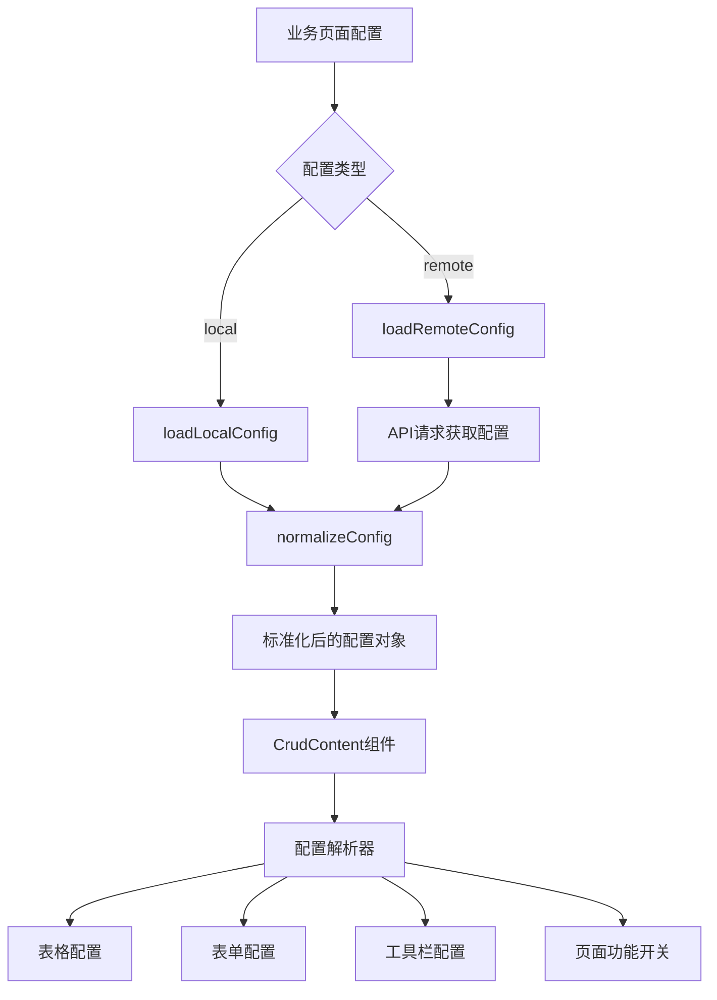

# Crud 组件执行流程与开发机制

## 📋 文档概述

本文档详细说明了 azure-mpurse-admin 项目中 Crud 组件的完整执行流程、组件交互机制和业务代码调整逻辑，为 AI 开发提供完整的技术上下文。

## 🏗️ 架构概览

### 双层架构设计

```
┌─────────────────────────────────────────────────────────────┐
│                    Business Layer (业务层)                   │
│  apps/mpurse-central/src/views/settings/upgrade/index.vue  │
│                         │                                   │
│                         ▼                                   │
│                   LocalCrudConfig                           │
│                   (本地配置对象)                              │
└─────────────────────────┬───────────────────────────────────┘
                          │
┌─────────────────────────▼───────────────────────────────────┐
│                Component Layer (组件层)                     │
│           apps/mpurse-central/src/components/Crud/           │
│  ┌─────────────┐  ┌─────────────┐  ┌─────────────┐        │
│  │ index.vue   │  │CrudContent  │  │ ActionBar   │        │
│  │ (主入口)     │  │   .vue      │  │   .vue      │        │
│  └─────────────┘  └─────────────┘  └─────────────┘        │
│  ┌─────────────┐  ┌─────────────┐  ┌─────────────┐        │
│  │   hooks/    │  │   types/    │  │   utils/    │        │
│  │(业务逻辑钩子)│  │ (类型定义)   │  │(配置工具)   │        │
│  └─────────────┘  └─────────────┘  └─────────────┘        │
└─────────────────────────┬───────────────────────────────────┘
                          │
┌─────────────────────────▼───────────────────────────────────┐
│                 Shared Layer (共享层)                       │
│              shared/components/Crud/                        │
│  ┌─────────────┐  ┌─────────────┐                          │
│  │BasicCrud    │  │   index.ts  │                          │
│  │  .vue       │  │  (导出文件)  │                          │
│  │(基础组件)    │  │             │                          │
│  └─────────────┘  └─────────────┘                          │
└─────────────────────────────────────────────────────────────┘
```

## 🔄 完整执行流程

### 1. 组件初始化流程

```typescript
// 步骤1: 业务页面创建配置对象
const config: LocalCrudConfig = {
  title: 'Upgrade Management',
  pageConfig: { enableSearch: true, enableToolbar: true },
  options: { formOptions: {...}, gridOptions: {...} }
}

// 步骤2: 传递配置到Crud组件
<Crud ref="crudRef" local :config="config" />

// 步骤3: Crud主入口组件处理
// apps/.../Crud/index.vue
const { config: crudConfig, loadLocalConfig } = useCrudConfig()
loadLocalConfig(props.config) // 标准化配置

// 步骤4: 传递到内容组件
<CrudContent :config="crudConfig" :type="local" />
```

### 2. 配置处理流程



### 3. 数据请求流程

```typescript
// 步骤1: 表格配置中的数据代理
proxyConfig: {
  ajax: {
    query: async ({ page }, formValues) => {
      // 步骤2: 调用request客户端
      const res = await request.get({
        url: '/mpmapi/mpurse/version',
        params: {
          page: page.currentPage,
          limit: page.pageSize,
          ...formValues, // 搜索表单的值
        },
      });
      // 步骤3: 返回标准格式数据
      return res; // {items: [], count: 0}
    },
  },
}

// 步骤4: VXE Table处理响应数据并渲染
```

## 🎯 关键组件交互机制

### 1. 主入口组件 (index.vue)

**职责**：
- 处理配置模式切换（本地/远程）
- 管理组件生命周期
- 暴露外部API接口

```typescript
// 关键交互逻辑
const { config: crudConfig, loadLocalConfig, loadRemoteConfig } = useCrudConfig()

// 配置加载
const loadConfig = async () => {
  if (props.remote) {
    await loadRemoteConfig() // 远程配置
  } else {
    loadLocalConfig(props.config) // 本地配置
  }
}

// 对外暴露方法
defineExpose<CrudInstance>({
  reload: () => crudRef.value?.reload(),
  query: (params?: any) => crudRef.value?.query(params),
  get gridApi() { return crudRef.value?.gridApi },
  get tabApi() { return crudRef.value?.tabApi },
})
```

### 2. 内容组件 (CrudContent.vue)

**职责**：
- 配置解析和标准化
- UI组件组装和渲染
- 事件处理和状态管理

```typescript
// 关键交互逻辑
const pageConfig = computed(() => ({
  ...getDefaultPageConfig(),
  ...props.config?.pageConfig,
}))

// 动态配置计算
const toolbarActions = computed(() => getToolbarActions(props.config, isRemoteConfig.value, pageConfig.value))
const gridColumns = computed(() => getGridColumns(props.config, isRemoteConfig.value))
const formFields = computed(() => getFormFields(props.config, isRemoteConfig.value))

// 表格实例创建
const [Grid, gridApi] = useVbenVxeGrid({
  formOptions: mergedFormOptions.value,
  gridOptions: mergedGridOptions.value,
  gridEvents: mergedGridEvents.value,
})
```

### 3. 配置管理钩子 (use-crud-config.ts)

**职责**：
- 配置标准化处理
- 远程配置获取
- 配置合并和更新

```typescript
// 关键交互逻辑
const normalizeConfig = (rawConfig: any, isRemote = false) => {
  if (isRemote && rawConfig.schema) {
    // 远程配置转换
    const normalizedConfig: RemoteCrudConfig = {
      api: rawConfig.api,
      schema: { list: [], filter: [], create: [], update: [] },
      actions: rawConfig.actions || [],
      options: rawConfig.options || {},
    }
    return normalizedConfig
  }

  // 本地配置标准化
  const localConfig: LocalCrudConfig = { ...rawConfig }
  if (!localConfig.pageConfig) {
    localConfig.pageConfig = getDefaultPageConfig()
  }
  return localConfig
}
```

## 📊 业务代码调整逻辑

### 1. 页面功能开关调整

```typescript
// 原始配置
pageConfig: {
  enableSearch: true,    // 搜索表单
  enableToolbar: true,   // 工具栏
  enablePagination: true, // 分页
  enableSelection: true,  // 行选择
  enableTabs: false,     // 标签页模式
}

// 调整逻辑示例：禁用搜索，启用标签页
pageConfig: {
  enableSearch: false,   // 禁用搜索 → 隐藏搜索表单
  enableTabs: true,      // 启用标签页 → 显示标签页组件
  // 其他配置保持不变
}
```

### 2. 表格列配置调整

```typescript
// 基础列配置
columns: [
  { field: 'id', title: 'ID', width: 80 },
  { field: 'name', title: '名称', width: 150 },
]

// 添加状态切换列
columns: [
  { field: 'id', title: 'ID', width: 80 },
  { field: 'name', title: '名称', width: 150 },
  {
    field: 'is_active',
    title: 'Status',
    width: 110,
    slots: {
      default: ({ row }) => {
        return h(Switch, {
          checked: row.is_active,
          onChange: () => toggleStatus(row)
        })
      }
    }
  }
]
```

### 3. 表单字段动态调整

```typescript
// 基础表单字段
schema: [
  { fieldName: 'name', component: 'Input', label: '名称' }
]

// 根据业务需求动态调整
const generateFormSchema = (userRole: string) => {
  const baseSchema = [
    { fieldName: 'name', component: 'Input', label: '名称', rules: 'required' }
  ]

  // 管理员才能看到状态字段
  if (userRole === 'admin') {
    baseSchema.push({
      fieldName: 'is_active',
      component: 'Switch',
      label: '状态',
      defaultValue: true
    })
  }

  return baseSchema
}
```

### 4. API端点动态调整

```typescript
// 基础API配置
const config = {
  api: '/api/users',
  extraApis: {
    export: '/api/users/export'
  }
}

// 根据环境动态调整
const getApiConfig = (env: string) => {
  const baseUrl = env === 'production' ? '/prod-api' : '/mpmapi'

  return {
    api: `${baseUrl}/mpurse/users`,
    extraApis: {
      export: `${baseUrl}/mpurse/users/export`,
      import: `${baseUrl}/mpurse/users/import`
    }
  }
}
```

### 5. 父子组件（弹窗）数据传递与回显模式

**业务场景**：
在列表页或详情页中，通过操作按钮（如“新增”、“编辑”）打开一个独立的弹窗组件，并需要将当前操作行的数据（如 ID）传递给弹窗，在弹窗的表单中进行回显。

**实现原理**：
通过 `props` 实现父子组件通信，并结合 `watch` 侦听器和 `nextTick` 确保在弹窗完全打开后安全地回填表单数据。

---

#### 完整实现方案

##### 1. 父组件：通过 Prop 传递数据

在父组件中，当触发弹窗显示时，将需要传递的数据对象绑定到子组件（弹窗）的 prop 上。

**示例位置**：父组件（如：列表页 `xxx-list.vue` 或详情页 `xxx-detail.vue`）

```vue
<template>
  <!-- ... other template code ... -->

  <!-- AI: 调用弹窗组件，并通过 record-data prop 传递整个 contextData 对象 -->
  <AddMarkupModal
    v-if="addMarkupModalVisible"
    :open="addMarkupModalVisible"
    :record-data="props.contextData"
    @cancel="addMarkupModalVisible = false"
    @success="handleAddMarkupSuccess"
  />
</template>

<script setup lang="ts">
// ...
const props = defineProps<{
  contextData?: any;
}>();

const addMarkupModalVisible = ref(false);

const openAddMarkupModal = () => {
  addMarkupModalVisible.value = true;
};
// ...
</script>
```

**关键点**：
-   ✅ 使用一个 prop（如 `record-data`）来传递完整的数据对象，而不是单个 ID，这提供了更好的扩展性。
-   ✅ 父组件负责控制弹窗的显示状态（`addMarkupModalVisible`）。

---

##### 2. 子组件（弹窗）：接收并处理数据

在子组件（弹窗）中，定义相应的 prop 来接收数据，并使用 `watch` 侦听弹窗的打开状态，然后安全地更新表单。

**示例位置**：子组件（如：弹窗组件 `xxx-modal.vue`）

```vue
<script setup lang="ts">
import { ref, watch, nextTick } from 'vue';
import { useVbenForm } from '@vben/common-ui';

// 1. 定义 props 接收父组件传递的数据
const props = defineProps({
  open: {
    type: Boolean,
    required: true,
  },
  recordData: {
    type: Object,
    default: () => ({}),
  },
});

const [Form, formApi] = useVbenForm(...);

// 2. 侦听 open 状态，在弹窗打开时回显数据
watch(
  () => props.open,
  (isOpen) => {
    if (isOpen && props.recordData?.id) {
      // 3. 使用 nextTick 确保表单实例已准备就绪
      nextTick(() => {
        formApi.setValues({ id: props.recordData.id });
      });
    } else if (!isOpen) {
      // 4. 关闭时重置表单
      formApi.resetForm();
    }
  },
  { immediate: true },
);

// 5. 在提交时，从 prop 中获取所需的 ID
async function handleOk() {
  // ...
  const params = {
    ...values,
    merchant_id: props.recordData.id, // 从 recordData 获取 ID
  };
  await request.post({
    url: `/pnapi/markups/merchants/${props.recordData.id}`,
    data: params,
  });
  // ...
}
</script>
```

**核心逻辑**：
1.  **定义 Prop**：在子组件中定义 `recordData` prop 来接收父组件传递的对象。
2.  **侦听状态**：使用 `watch` 侦听 `open` prop 的变化。这是触发回显逻辑的关键。
3.  **安全更新**：在 `watch` 回调中，使用 `nextTick` 来确保 DOM 更新和表单组件内部状态都已完成后，再调用 `formApi.setValues()`。这可以避免因组件尚未完全渲染而导致设置失败的问题。
4.  **表单重置**：当弹窗关闭时 (`isOpen` 为 `false`)，调用 `formApi.resetForm()` 清空表单，避免下次打开时残留旧数据。
5.  **数据使用**：在需要的地方（如提交数据时），从 `props.recordData` 中安全地获取数据。

---

## 🔧 开发机制详解

### 1. 配置驱动开发

**原则**：所有功能通过配置对象控制，避免硬编码

```typescript
// ✅ 好的实践 - 配置驱动
const config: LocalCrudConfig = {
  pageConfig: { enableSearch: needsSearch },
  options: {
    gridOptions: { 
      columns: generateColumns(businessType) 
    },
    formOptions: { 
      schema: generateFormFields(userPermissions) 
    }
  }
}

// ❌ 避免的实践 - 硬编码
if (businessType === 'user') {
  // 硬编码的业务逻辑
}
```

### 2. 响应式配置更新

```typescript
// 监听业务状态变化，动态更新配置
const updateCrudConfig = (newBusinessState: any) => {
  const updatedConfig = {
    ...currentConfig.value,
    pageConfig: {
      ...currentConfig.value.pageConfig,
      enableSelection: newBusinessState.allowBatchOperation
    },
    options: {
      ...currentConfig.value.options,
      toolbarActions: generateToolbarActions(newBusinessState.userPermissions)
    }
  }

  // 更新配置会自动触发UI重新渲染
  crudConfigRef.value = updatedConfig
}
```

### 3. 事件驱动交互

```typescript
// 组件间通信机制
const gridEvents = {
  // 表格选择事件
  checkboxChange: ({ $grid }) => {
    const selectedRows = $grid.getCheckboxRecords()
    // 触发工具栏按钮状态更新
    emit('selection-change', selectedRows)
  },

  // 行操作事件
  cellClick: ({ row, column }) => {
    if (column.field === 'action') {
      // 触发自定义业务逻辑
      handleRowAction(row)
    }
  }
}
```

### 4. 插槽扩展机制

```typescript
// 组件内部：预留插槽
<template>
  <div class="crud-container">
    <!-- 工具栏扩展插槽 -->
    <slot name="toolbar-extra" :selected-rows="selectedRows" />

    <!-- 表格列扩展插槽 -->
    <VxeGrid>
      <template #table-avatar="{ row }">
        <slot name="table-avatar" :row="row">
          <DefaultAvatar :src="row.avatar" />
        </slot>
      </template>
    </VxeGrid>
  </div>
</template>

// 业务页面：使用插槽
<Crud :config="config">
  <template #toolbar-extra="{ selectedRows }">
    <Button @click="exportSelected(selectedRows)">导出选中</Button>
  </template>

  <template #table-avatar="{ row }">
    <CustomAvatar :user="row" :show-status="true" />
  </template>
</Crud>
```

## 📋 标准开发流程

### 1. 新建CRUD页面标准流程

```typescript
// Step 1: 定义页面配置
const config: LocalCrudConfig = {
  title: '资源管理',
  pageConfig: {
    enableSearch: true,
    enableToolbar: true,
    enablePagination: true,
  },
  options: {
    formOptions: { schema: [...] },
    gridOptions: { columns: [...], proxyConfig: {...} },
    toolbarActions: [...]
  }
}

// Step 2: 创建Vue组件
<template>
  <Crud ref="crudRef" local :config="config">
    <!-- 自定义插槽内容 -->
  </Crud>
</template>

// Step 3: 实现业务逻辑
const crudRef = ref()
const refresh = () => crudRef.value?.reload()
const handleCustomAction = (row) => { /* 自定义逻辑 */ }
```

### 2. 配置调试流程

```typescript
// 开发环境调试
if (import.meta.env.DEV) {
  console.log('Crud Config:', config)
  console.log('Page Config:', pageConfig.value)
  console.log('Grid Columns:', gridColumns.value)
  console.log('Form Fields:', formFields.value)
}

// 运行时配置验证
const validateConfig = (config: LocalCrudConfig) => {
  if (!config.api && !config.options?.gridOptions?.proxyConfig) {
    console.warn('缺少数据源配置')
  }

  if (config.pageConfig?.enableSearch && !config.options?.formOptions?.schema?.length) {
    console.warn('启用了搜索但未配置搜索字段')
  }
}
```

### 3. 性能优化机制

```typescript
// 配置缓存
const configCache = new Map()
const getCachedConfig = (cacheKey: string, configGenerator: () => LocalCrudConfig) => {
  if (!configCache.has(cacheKey)) {
    configCache.set(cacheKey, configGenerator())
  }
  return configCache.get(cacheKey)
}

// 懒加载组件
const LazyActionBar = defineAsyncComponent(() => import('./ActionBar.vue'))
const LazyCrudContent = defineAsyncComponent(() => import('./CrudContent.vue'))

// 虚拟滚动（大数据量）
const gridOptions = {
  height: 400,
  scrollY: { enabled: true, mode: 'row', rSize: 50 }, // 虚拟滚动
  columns: [...]
}
```

## 🎨 扩展开发模式

### 1. 自定义组件集成

```typescript
// 注册自定义表格列组件
const customCellRenderer = {
  name: 'CustomStatus',
  component: MyCustomStatusComponent,
  props: { type: 'status' }
}

// 在配置中使用
columns: [
  {
    field: 'status',
    title: '状态',
    cellRender: customCellRenderer
  }
]
```

### 2. 业务钩子扩展

```typescript
// 自定义业务钩子
export function useBusinessLogic(crudApi: any) {
  const processBeforeSubmit = (data: any) => {
    // 提交前处理逻辑
    return { ...data, processedAt: Date.now() }
  }

  const processAfterLoad = (data: any[]) => {
    // 加载后处理逻辑
    return data.map(item => ({
      ...item,
      displayName: `${item.firstName} ${item.lastName}`
    }))
  }

  return { processBeforeSubmit, processAfterLoad }
}

// 在组件中使用
const { processBeforeSubmit, processAfterLoad } = useBusinessLogic(gridApi)
```

### 3. 主题与样式扩展

```typescript
// 主题配置
const themeConfig = {
  primaryColor: '#1890ff',
  borderRadius: '6px',
  fontSize: '14px'
}

// 样式变量注入
const crudStyles = computed(() => ({
  '--crud-primary-color': themeConfig.primaryColor,
  '--crud-border-radius': themeConfig.borderRadius,
  '--crud-font-size': themeConfig.fontSize
}))
```

### 4. 状态列样式规范 (v2.0 推荐标准)

为实现全局统一、高度可维护的状态列样式，项目已全面采用配置驱动的 `StatusTag` 通用组件方案。此方案取代了旧的、分散在各页面的 `ATag` 实现。

#### 设计原则

- **配置驱动**: 所有状态的文本和样式（颜色、边框等）都在一个中心化的文件中进行配置，UI 组件只负责渲染。
- **关注点分离**: 业务页面（如 `merchant-list.vue`）不关心状态的具体样式，只负责传递原始状态值和状态类型；`StatusTag` 组件不关心业务，只负责根据类型和值进行渲染。

#### 核心文件

1.  **状态配置文件**: `shared/constants/status.ts`
    -   **职责**: 定义项目中所有类型的状态及其显示方式。这是项目中所有状态样式的“唯一真实来源”。

2.  **通用状态组件**: `shared/components/StatusTag/StatusTag.vue`
    -   **职责**: 接收一个 `status` (状态值) 和 `type` (状态类型)，并根据 `status.ts` 的配置渲染出对应的标签样式。

#### 实现步骤

##### 步骤 1: 定义状态 (如果需要新增)

打开 `shared/constants/status.ts` 文件，在 `statusMap` 对象中，为您需要的状态类型（如 `kyc`, `status`）添加或修改状态定义。所有样式均使用 Tailwind CSS 工具类。

```typescript
// shared/constants/status.ts

export type StatusType = 'active' | 'kyc' | 'status';

export const statusMap: Record<StatusType, Record<string, { ... }>> = {
  // ... 其他状态类型
  kyc: {
    success: {
      text: 'Success',
      dotColor: 'bg-blue-500',
      bgColor: 'bg-blue-100',
      textColor: 'text-blue-700',
      borderColor: 'border border-blue-200',
    },
    pending: {
      text: 'Pending',
      dotColor: 'bg-yellow-500',
      bgColor: 'bg-yellow-100',
      textColor: 'text-yellow-700',
      borderColor: 'border border-yellow-200',
    },
    // ... 更多状态值
    default: {
      text: 'N/A',
      // ... 默认样式
    },
  },
};
```

##### 步骤 2: 在 Crud 表格列中使用

在您的业务页面 (如 `merchant-list.vue`) 的 `gridOptions` 配置中，为需要显示状态的列配置 `slots`，并使用 `h` 函数渲染 `StatusTag` 组件。

```typescript
// 1. 在 <script setup> 中导入 StatusTag 组件
import { StatusTag } from '@shared/components';
import { h } from 'vue';

// 2. 在 gridOptions.columns 数组中配置状态列
{
  field: 'status', // 后端返回的原始状态字段, e.g., 'active'
  title: 'Status',
  minWidth: 120,
  slots: {
    default: ({ row }) => {
      // 调用 StatusTag 组件
      return h(StatusTag, {
        status: row.status, // 传递原始状态值
        type: 'status',     // 传递状态类型，对应 status.ts 中的顶级键
      });
    },
  },
},
{
  field: 'kyc_status_display', // e.g., 'pending'
  title: 'KYC',
  minWidth: 120,
  slots: {
    default: ({ row }) => {
      return h(StatusTag, {
        status: row.kyc_status_display,
        type: 'kyc',
      });
    },
  },
},
{
  field: 'is_active', // e.g., true or false
  title: 'Active',
  minWidth: 120,
  slots: {
    default: ({ row }) => {
      return h(StatusTag, {
        status: String(row.is_active), // 将布尔值转为字符串 'true' 或 'false'
        type: 'active',
      });
    },
  },
},
```

**优势**: 通过这种方式，当需要修改“待处理”状态的颜色时，只需在 `status.ts` 中修改一次，所有使用 `type: 'kyc'` 和 `status: 'pending'` 的 `StatusTag` 都会自动更新，无需改动任何业务页面代码。

---

## 🔄 表单数据转换模式（重要）

### Select 组件的 ID/Code 双向转换机制

**业务场景**：
- 后端存储和传输使用 **ID**（数字类型，数据库主键）
- 前端表单回显使用 **Code**（字符串类型，业务代码，用户可读）

**实现原理**：
通过选项数据结构设计 + `onOpened` 钩子实现数据转换。

---

### 完整实现方案

#### 1. 选项数据结构设计

```typescript
/**
 * 获取 Upstream 选项数据
 * @description 从后端获取上游渠道列表
 * - 选项 value 使用 id（用于表单提交）
 * - 保留 code 字段（用于前端回显转换）
 */
const fetchUpstreamOptions = async () => {
  try {
    const res = await request.get({
      url: '/mpmapi/mpursemc/upstream',
      params: { page: 1, limit: 15 },
    });

    // 选项结构：保留完整的 id、code、name 信息
    upstreamOptions.value = res.items.map((item: any) => ({
      label: item.name,      // 显示名称
      value: item.id,        // 用于表单值（提交给后端）
      id: item.id,           // 原始 ID
      code: item.code,       // 业务代码（用于回显转换）
    }));
  } catch (error) {
    console.error('Failed to fetch upstream options:', error);
  }
};
```

**关键点**：
- ✅ `value` 使用 `id`：确保表单提交的是后端需要的 ID
- ✅ 保留 `code` 字段：用于回显时的数据转换
- ✅ 保留 `label`：用于下拉选项的显示

---

#### 2. 表单回显时转换（ID → Code）

```typescript
hooks: {
  /**
   * 表单打开后的数据回显
   * @description 将后端返回的 upstream id 转换为 code 进行回显
   * 
   * 业务逻辑：
   * 1. 后端返回 upstream = 123 (id)
   * 2. 查找 id=123 对应的 code
   * 3. 将 code 设置到表单字段，用户看到的是 code
   */
  onOpened: async ({ context, instance }) => {
    const res = await request.get({
      url: `/mpmapi/mpursemc/merchantproduct/${context.id}`,
    });

    // 如果后端返回的是 id，需要转换为 code 进行回显
    if (res.upstream) {
      const selectedOption = upstreamOptions.value.find(
        (opt) => opt.id === res.upstream,
      );
      if (selectedOption) {
        // 关键：将 id 转换为 code，用户看到的是 code
        res.upstream = selectedOption.code;
      }
    }

    instance.setValues(res);
  },
}
```

**核心逻辑**：
1. 后端返回 `upstream: 123` (ID)
2. 在 `upstreamOptions` 中查找 `id === 123` 的选项
3. 找到对应的 `code`（如 "CHANNEL_A"）
4. 将表单字段设置为 `code`，用户看到的是可读的业务代码

---

### 完整数据流程

```
1. 用户点击编辑
   ↓
2. onOpened: 后端返回 upstream=123 (id)
   ↓
3. 转换: 查找 id=123 对应的 code="CHANNEL_A"
   ↓
4. 表单回显: Select 显示 "CHANNEL_A"
   ↓
5. 用户选择其他选项: "CHANNEL_B"
   ↓
6. 表单提交: 由于 Select 的 value 是 id，直接提交 upstream=456 (id)
   ↓
7. 后端接收: upstream=456 (id)
```

---

### 实际应用示例（Merchant Products 页面）

**文件位置**：`apps/mpurse-central/src/views/merchant/components/merchant-list-detail.vue`

```typescript
// 1. 获取选项数据
const upstreamOptions = ref<any[]>([]);

const fetchUpstreamOptions = async () => {
  const res = await request.get({
    url: '/mpmapi/mpursemc/upstream',
    params: { page: 1, limit: 15 },
  });
  upstreamOptions.value = res.items.map((item: any) => ({
    label: item.name,
    value: item.id,    // 表单值使用 id
    id: item.id,
    code: item.code,   // 保留 code 用于回显
  }));
};

// 2. 表单配置
{
  fieldName: 'upstream',
  component: 'Select',
  label: 'Upstream',
  componentProps: {
    options: computed(() => upstreamOptions.value),
    placeholder: 'Please select upstream',
  },
}

// 3. 编辑操作的钩子配置
hooks: {
  onOpened: async ({ context, instance }) => {
    const res = await request.get({
      url: `/mpmapi/mpursemc/merchantproduct/${context.id}`,
    });

    // ID → Code 转换
    if (res.upstream) {
      const selectedOption = upstreamOptions.value.find(
        (opt) => opt.id === res.upstream,
      );
      if (selectedOption) {
        res.upstream = selectedOption.code; // 回显 code
      }
    }

    instance.setValues(res);
  },
  beforeSubmit: (values) => {
    // 由于 value 已经是 id，直接提交
    return { ...values };
  },
}
```

---

### 关键要点总结

| 阶段 | 数据类型 | 说明 |
|------|---------|------|
| **后端存储** | ID (数字) | 数据库主键，如 `123` |
| **后端返回** | ID (数字) | API 返回 `upstream: 123` |
| **前端回显** | Code (字符串) | 用户看到 `"CHANNEL_A"` |
| **用户选择** | Code (字符串) | 用户选择 `"CHANNEL_B"` |
| **表单提交** | ID (数字) | 提交给后端 `upstream: 456` |

---

### 最佳实践建议

#### ✅ 推荐做法

1. **选项数据结构完整**：保留 `id`、`code`、`label` 三个字段
2. **明确数据转换点**：在 `onOpened` 中进行 ID → Code 转换
3. **添加详细注释**：说明转换逻辑和业务原因
4. **错误处理**：找不到对应选项时的降级处理

```typescript
if (res.upstream) {
  const selectedOption = upstreamOptions.value.find(
    (opt) => opt.id === res.upstream,
  );
  if (selectedOption) {
    res.upstream = selectedOption.code;
  } else {
    // 降级处理：找不到对应选项时保持原值或设置为空
    console.warn(`Upstream option not found for id: ${res.upstream}`);
    res.upstream = null;
  }
}
```

#### ❌ 避免的做法

1. **硬编码转换逻辑**：不要在多个地方重复转换代码
2. **缺少类型定义**：应该定义清晰的选项类型接口
3. **忽略边界情况**：未处理选项未找到的情况

---

### 调试技巧

```typescript
// 在 onOpened 中添加调试日志
onOpened: async ({ context, instance }) => {
  const res = await request.get({ url: `/api/resource/${context.id}` });

  console.log('原始数据:', res);
  console.log('可用选项:', upstreamOptions.value);

  if (res.upstream) {
    const selectedOption = upstreamOptions.value.find(
      (opt) => opt.id === res.upstream,
    );
    console.log('匹配的选项:', selectedOption);

    if (selectedOption) {
      res.upstream = selectedOption.code;
      console.log('转换后的值:', res.upstream);
    }
  }

  instance.setValues(res);
}
```

---

## 🖼️ ImageUpload 图片上传组件

### 组件概述

`ImageUpload` 是项目中用于图片上传的通用组件,基于 Ant Design Vue 的 Upload 组件封装,支持图片预览、文件大小校验、自定义上传接口等功能。

**组件位置**：`shared/components/ImageUpload/ImageUpload.vue`

---

### 在表单中使用 ImageUpload

#### 1. 基础配置

```typescript
{
  fieldName: 'icon',
  component: 'ImageUpload',
  label: 'Icon URL',
  componentProps: {
    placeholder: 'Please enter icon URL',
    allowClear: true,
  },
  defaultValue: 'https://',
}
```

**参数说明**：
- `fieldName`: 字段名,用于表单数据绑定
- `component`: 组件类型,固定为 `'ImageUpload'`
- `label`: 表单项标签
- `componentProps`: 组件属性配置
- `defaultValue`: 默认值(可选)

---

### 组件 Props 配置

| 属性 | 类型 | 默认值 | 说明 |
|------|------|--------|------|
| `accept` | `string` | `'image/*'` | 接受的文件类型 |
| `listType` | `'picture' \| 'picture-card' \| 'text'` | `'picture-card'` | 上传列表的样式 |

---

## ⚙️ 数据格式化与渲染规范

### 1. 日期时间字符串的可靠解析与显示

#### 问题背景

在与后端 API 交互时，经常会接收到 ISO 8601 格式的日期时间字符串，例如 `2025-09-15T08:55:52.681385+00:00Z`。这种字符串虽然标准，但存在两个潜在的兼容性问题：

1.  **高精度时间戳**：包含超过3位小数（微秒级），部分 JavaScript 日期解析库（包括 `dayjs`）可能无法正确处理。
2.  **冗余时区标识**：同时包含 `+00:00` 和 `Z`，两者都表示 UTC 时间，可能导致解析器混淆。

直接使用 `dayjs(apiDateString)` 解析可能导致 "Invalid Date" 错误。

#### 解决方案：创建全局格式化工具函数

为了彻底解决此问题，我们应创建一个全局的、健壮的日期时间格式化函数，并在所有需要显示 API 返回时间的地方统一调用。

#### 实现步骤

##### 步骤 1: 创建或更新日期工具函数

在 `shared/utils/` 目录下（例如 `date.ts`），创建或更新一个日期处理文件，并添加以下工具函数：

```typescript
// shared/utils/date.ts
import dayjs from 'dayjs';

/**
 * 安全地解析并格式化从 API 返回的日期时间字符串。
 * - 解决了微秒精度过高（超过3位）的问题。
 * - 解决了双重时区标识（+00:00Z）的问题。
 * @param dateString - 从后端 API 获取的原始日期时间字符串。
 * @param format - 期望的输出格式，默认为 'YYYY-MM-DD HH:mm:ss'。
 * @returns 格式化后的日期字符串，如果输入无效则返回 '-'。
 */
export function formatApiDateTime(
  dateString?: string | null,
  format = 'YYYY-MM-DD HH:mm:ss',
): string {
  if (!dateString) {
    return '-';
  }

  try {
    // 预处理字符串：将秒的小数部分截断为3位（毫秒）
    const cleanedString = dateString.replace(/(\.\d{3})\d+/, '$1');

    const d = dayjs(cleanedString);
    if (d.isValid()) {
      return d.format(format);
    }
    return '-';
  } catch (error) {
    console.error('Failed to parse date string:', dateString, error);
    return '-';
  }
}
```

##### 步骤 2: 在 VxeGrid 中全局注册并使用 Formatter

`VxeGrid` 允许我们注册全局的格式化函数，这是最佳实践。

```typescript
// 在项目入口或 VxeGrid 的全局配置文件中
import { VXETable } from 'vxe-table';
import { formatApiDateTime } from '@shared/utils/date';

// 注册一个名为 'formatApiDateTime' 的全局 formatter
VXETable.formats.add('formatApiDateTime', ({ cellValue }) => {
  return formatApiDateTime(cellValue);
});
```

##### 步骤 3: 在表格列定义中直接使用

完成全局注册后，在任何 `Crud` 页面的 `gridOptions` 中，只需简单地指定 `formatter` 的名称即可。

```typescript
// 在业务页面的 gridOptions.columns 中
{
  field: 'success_time',
  title: 'Success Time',
  width: 180,
  // 直接使用已注册的 formatter 名称
  formatter: 'formatApiDateTime',
},
{
  field: 'ctime',
  title: 'Created Time',
  width: 180,
  // 同样使用
  formatter: 'formatApiDateTime',
}
```

#### 优势

- **健壮性**: 彻底解决了因 API 返回的日期格式不规范而导致的 "Invalid Date" 问题。
- **一致性**: 保证了整个应用中所有日期的显示格式统一。
- **可维护性**: 日期格式化逻辑集中在一处，未来若需调整格式，只需修改 `formatApiDateTime` 一个函数即可。
- **代码简洁**: 业务页面的列定义变得非常干净，只需指定 `formatter: 'formatApiDateTime'`，无需重复导入和调用函数。

## 📏 表格横向滚动规范 (VxeGrid)

为确保在不同场景下表格的可读性和用户体验，所有基于 `VxeGrid` 的表格组件在处理多列显示时，必须遵循以下滚动行为规范。

### 场景一：列数多，需要横向滚动

当表格的列数较多，其内容总宽度可能超出标准屏幕宽度时，**必须**启用横向滚动功能。

**实现规则**:

1.  **禁用列宽自适应**：在 `gridOptions` 配置中，**禁止**设置 `fit: true` 属性。最佳实践是直接省略该属性，以使用其 `false` 的默认值。
2.  **指定列最小宽度**：必须为绝大多数列通过 `width` 或 `minWidth` 属性指定一个明确的宽度。这为表格提供了计算总宽度的依据，是触发滚动条出现的先决条件。

**✅ 正确示例**:

```typescript
// 在业务页面的 gridOptions 中
const gridOptions: VxeGridProps = {
  // ... 其他配置
  // 🔴 注意：此处没有 'fit: true'
  columns: [
    { field: 'id', title: 'ID', width: 80 },
    { field: 'order_no', title: 'Order No', width: 260 },
    { field: 'merchant_no', title: 'Merchant No', minWidth: 150 },
    // ... 更多带有 width 或 minWidth 的列
  ],
};
```

### 场景二：列数少，无需横向滚动

当表格的列数较少，希望所有列能自动拉伸以填满整个表格容器宽度，从而获得更好的视觉效果时，可以禁用横向滚动。

**实现规则**:

1.  **启用列宽自适应**：在 `gridOptions` 配置中，**必须**设置 `fit: true`。

**✅ 正确示例**:

```typescript
// 在业务页面的 gridOptions 中
const gridOptions: VxeGridProps = {
  // ... 其他配置
  fit: true, // 🔴 关键：设置为 true
  columns: [
    { field: 'id', title: 'ID' }, // width 在此场景下为可选
    { field: 'name', title: 'Name' },
    { field: 'role', title: 'Role' },
  ],
};
```

### 总结

| 期望行为 | `fit` 属性 | 列宽 (`width`/`minWidth`) |
| :--- | :--- | :--- |
| **需要横向滚动** | **省略**或 `false` | **必须**为多数列指定 |
| **无需横向滚动** | `true` | 可选（作为权重） |

**AI 开发指令**：在处理表格相关的开发任务时，请优先遵循此规范。当用户提出关于表格布局或滚动的需求时，应首先检查并调整 `fit` 属性和列的 `width`/`minWidth` 配置。

## ⚙️ 数据格式化与渲染规范

### 1. 日期时间字符串的可靠解析与显示

#### 问题背景

在与后端 API 交互时，经常会接收到 ISO 8601 格式的日期时间字符串，例如 `2025-09-15T08:55:52.681385+00:00Z`。这种字符串虽然标准，但存在两个潜在的兼容性问题：

1.  **高精度时间戳**：包含超过3位小数（微秒级），部分 JavaScript 日期解析库（包括 `dayjs`）可能无法正确处理。
2.  **冗余时区标识**：同时包含 `+00:00` 和 `Z`，两者都表示 UTC 时间，可能导致解析器混淆。

直接使用 `new Date()` 或 `dayjs()` 解析这类字符串，可能会失败并返回 `Invalid Date`。

#### 解决方案与规范：先净化，后解析

为确保日期时间能够被稳定、可靠地解析，所有从后端接收的日期字符串在传递给格式化库（如 `dayjs`）之前，**必须**先经过一个“净化”（Sanitize）过程。

##### 标准实现：`sanitizeDateString` 函数

在项目中，我们应使用一个标准的辅助函数来完成此任务。

```typescript
/**
 * Sanitize a date string to make it compatible with dayjs parsing.
 * It truncates fractional seconds to milliseconds and removes redundant timezone 'Z'.
 * @param dateString The raw date string from the API.
 * @returns A sanitized date string.
 */
function sanitizeDateString(dateString: string): string {
  if (!dateString) return '';
  // Truncate fractional seconds to 3 digits (milliseconds) and remove trailing 'Z'
  return dateString.replace(/\.(\d{3})\d*([+-])/, '.$1$2').replace(/Z$/, '');
}
```

##### 应用场景

**场景一：在 Crud 表格的 `formatter` 中使用**

```typescript
// 在 gridOptions.columns 中配置
{
  field: 'txn_timestamp',
  title: 'Txn Timestamp',
  formatter: ({ cellValue }) => {
    if (!cellValue) return '-';
    // 1. 先净化
    const sanitized = sanitizeDateString(cellValue);
    // 2. 后解析
    const date = dayjs(sanitized);
    return date.isValid() ? date.format('YYYY-MM-DD HH:mm:ss') : 'Invalid Date';
  },
}
```

**场景二：在通用的 `formatDate` 辅助函数中使用**

```typescript
function formatDate(dateString: string) {
  if (!dateString) return '';
  // 1. 先净化
  const sanitized = sanitizeDateString(dateString);
  // 2. 后解析
  const date = dayjs(sanitized);
  return date.isValid() ? date.format('YYYY-MM-DD HH:mm:ss') : 'Invalid Date';
}
```

通过遵循“先净化，后解析”的原则，可以极大地提高日期处理的健壮性，避免因后端返回的日期格式细微差异而导致的页面显示问题。
| `maxCount` | `number` | `1` | 最大上传数量 |
| `maxSize` | `number` | `2` | 最大文件大小(MB) |
| `minSize` | `number` | `0` | 最小文件大小(MB) |
| `uploadUrl` | `string` | `'/capi/tools/uploadimage'` | 上传接口地址 |
| `responseField` | `string` | `'image_url'` | 响应结果字段名 |
| `uploadText` | `string` | `''` | 上传按钮文本 |
| `value` | `string \| string[]` | `[]` | 表单值(单图或多图) |

---

### 完整使用示例

#### 示例 1: BBPS Category 表单中的单图上传

**文件位置**：`apps/mpurse-central/src/views/merchant/bbps-category.vue`

```typescript
const bbpsCategoryFormOptions: VbenFormProps = {
  commonConfig: {
    labelWidth: 120,
  },
  layout: 'horizontal' as const,
  schema: [
    {
      fieldName: 'category_name',
      component: 'Input',
      label: 'Category Name',
      componentProps: {
        placeholder: 'Please enter category name',
        allowClear: true,
      },
      rules: 'required',
    },
    // ⭐ 图片上传字段配置
    {
      fieldName: 'icon',
      component: 'ImageUpload',
      label: 'Icon URL',
      componentProps: {
        placeholder: 'Please enter icon URL',
        allowClear: true,
        maxSize: 2,      // 限制文件大小为 2MB
        maxCount: 1,     // 只允许上传 1 张图片
      },
      defaultValue: 'https://',
    },
    {
      fieldName: 'sort',
      component: 'InputNumber',
      label: 'Sort',
      componentProps: {
        placeholder: 'Please enter sort',
        min: 0,
        max: 100,
      },
      defaultValue: 0,
      rules: 'required',
    },
  ],
};
```

#### 示例 2: 多图上传配置

```typescript
{
  fieldName: 'gallery',
  component: 'ImageUpload',
  label: 'Image Gallery',
  componentProps: {
    maxCount: 5,        // 允许上传最多 5 张图片
    maxSize: 5,         // 每张图片最大 5MB
    listType: 'picture-card',
  },
}
```

**数据格式**：
- 单图上传 (`maxCount: 1`): 返回字符串 `'https://example.com/image.jpg'`
- 多图上传 (`maxCount > 1`): 返回字符串数组 `['url1', 'url2', 'url3']`

---

### 组件注册配置

ImageUpload 组件在项目适配器中注册,配置文件位于 `apps/mpurse-central/src/adapter/component/index.ts`:

```typescript
import { ImageUpload } from '@shared/components';

// 项目特定的组件类型
export type ProjectSpecificComponentType = 'ImageUpload' | 'ApiCacheSelect';

// 项目特定的组件映射
const projectComponentMap: Partial<Record<ComponentType, Component>> = {
  ImageUpload: h(ImageUpload, {
    uploadUrl: '/mpmapi/tools/uploadimage', // central 项目特定的上传地址
  }),
};
```

**关键点**：
- ✅ ImageUpload 已全局注册,可在任何表单中直接使用
- ✅ 默认上传地址为 `/mpmapi/tools/uploadimage`(中央管理后台)
- ✅ 可在 `componentProps` 中覆盖 `uploadUrl` 使用自定义上传接口

---

### 上传接口要求

#### 请求格式

```http
POST /mpmapi/tools/uploadimage
Content-Type: multipart/form-data

file: <binary>
```

#### 响应格式

```json
{
  "image_url": "https://cdn.example.com/uploads/20250114/abc123.jpg"
}
```

**重要**：
- 后端响应必须包含 `image_url` 字段(默认),或通过 `responseField` 属性自定义字段名
- 上传成功后,组件自动将图片 URL 绑定到表单字段

---

### 表单回显与提交

#### 编辑表单的数据回显

```typescript
hooks: {
  onOpened: async ({ context, instance }) => {
    const res = await request.get({
      url: `/mpmapi/mpursemc/bbpscategory/${context.id}`,
    });
    // ImageUpload 组件会自动处理图片 URL 的回显
    // 不需要额外处理,直接使用返回的数据
    instance.setValues(res);
  },
}
```

**数据回显逻辑**：
1. 后端返回数据 `{ icon: 'https://example.com/icon.jpg' }`
2. `instance.setValues(res)` 将数据设置到表单
3. ImageUpload 组件自动将 URL 转换为文件列表进行展示

#### 表单提交的数据处理

```typescript
hooks: {
  beforeSubmit: (values) => {
    // ImageUpload 组件返回的是图片 URL(字符串或数组)
    // 直接提交给后端即可
    return {
      id: values.id,
      group_id: values.group,
      category_name: values.category_name,
      icon: values.icon,           // 单图: 字符串 URL
      // gallery: values.gallery,  // 多图: 字符串数组
      sort: values.sort,
      is_active: values.is_active,
    };
  },
  onSubmitSuccess: () => {
    message.success('Category updated successfully');
    refresh();
  },
}
```

---

### 组件特性

#### 1. 自动文件校验

组件内部自动校验文件大小,当文件不符合要求时会自动提示错误并移除:

```typescript
// 最小/最大文件大小校验
if (fileSize < props.minSize) {
  message.error('File size is too small');
  return;
}
if (fileSize > props.maxSize) {
  message.error('File size exceeds the limit');
  return;
}
```

#### 2. 图片预览功能

点击已上传的图片可以预览,支持的图片格式:
- `png`, `jpg`, `jpeg`, `gif`, `svg`, `webp`, `ico`, `bmp`
- Base64 格式图片 (`data:image/...`)

#### 3. 错误处理机制

上传失败时自动移除失败文件并提示错误信息

---

### 最佳实践

#### ✅ 推荐做法

1. **明确文件大小限制**: 根据业务需求设置合理的 `maxSize` 和 `minSize`
2. **单图使用 `maxCount: 1`**: 确保数据格式为字符串而非数组
3. **多图使用数组处理**: 后端接口需支持数组类型的图片字段
4. **添加默认值**: 避免表单初始化时出现空值警告

```typescript
// ✅ 好的实践
{
  fieldName: 'icon',
  component: 'ImageUpload',
  label: 'Icon',
  componentProps: {
    maxCount: 1,
    maxSize: 2,
  },
  defaultValue: 'https://',  // 提供默认值
}
```

#### ❌ 避免的做法

1. **不校验文件大小**: 可能导致上传超大文件占用服务器资源
2. **忽略 responseField 配置**: 后端响应字段名不一致会导致上传失败
3. **多图场景使用 maxCount: 1**: 会导致数据格式不一致

---

### 实际应用案例

#### BBPS Category 管理页面

**文件位置**：`apps/mpurse-central/src/views/merchant/bbps-category.vue`

**功能说明**：
- 编辑分类时可以上传分类图标
- 单图上传,限制最大 2MB
- 表单回显自动加载已上传的图标
- 提交时将图片 URL 发送给后端

**关键代码**：

```typescript
// 表单配置
{
  fieldName: 'icon',
  component: 'ImageUpload',
  label: 'Icon URL',
  componentProps: {
    placeholder: 'Please enter icon URL',
    allowClear: true,
  },
  defaultValue: 'https://',
}

// 编辑操作
{
  label: 'Edit',
  component: 'Button',
  useFormModal: true,
  modalType: 'drawer',
  hooks: {
    onOpened: async ({ context, instance }) => {
      const res = await request.get({
        url: `/mpmapi/mpursemc/bbpscategory/${context.id}`,
      });
      // 直接使用返回的数据,ImageUpload 自动处理
      instance.setValues(res);
    },
    beforeSubmit: (values) => {
      return {
        id: values.id,
        group_id: values.group,
        category_name: values.category_name,
        icon: values.icon,  // 图片 URL
        sort: values.sort,
        is_active: values.is_active,
      };
    },
  },
}
```

---

### 总结

ImageUpload 组件提供了完整的图片上传解决方案:

1. **✅ 开箱即用**: 已全局注册,直接在表单中使用
2. **✅ 自动校验**: 文件大小、类型、数量自动校验
3. **✅ 预览支持**: 点击图片即可预览
4. **✅ 表单集成**: 无缝集成到 Crud 表单系统
5. **✅ 国际化**: 错误提示自动支持多语言
6. **✅ 灵活配置**: 支持单图/多图、自定义接口等场景

---

## 🔧 表单验证规则系统

### 表单必填字段红色星号显示机制

#### 问题背景

在使用 Vben Form 表单系统时,当表单字段的 `rules` 属性使用复合验证规则(如 `'required|email'` 或 `'required|min:10|regex:^[0-9]+$'`)时,标签前的**红色星号 `*` 不显示**,导致用户无法识别必填字段。

**问题场景**:
```typescript
// ❌ 红色星号不显示
{
  fieldName: 'contactEmail',
  component: 'Input',
  label: 'Contact Email',
  rules: 'required|email',  // 复合规则
}

// ❌ 红色星号也不显示
{
  fieldName: 'contactPhone',
  component: 'Input',
  label: 'Contact Phone',
  rules: 'required|min:10|regex:^[0-9]+$',  // 多重复合规则
}

// ✅ 红色星号正常显示
{
  fieldName: 'name',
  component: 'Input',
  label: 'Name',
  rules: 'required',  // 单一规则
}
```

---

#### 问题根因分析

**文件位置**: `packages/@core/ui-kit/form-ui/src/form-render/form-field.vue`

**原始代码逻辑** (第 114-118 行):
```typescript
if (isString(currentRules.value)) {
  return (
    ['required', 'selectRequired'].includes(currentRules.value) ||
    currentRules.value.startsWith('re:')
  );
}
```

**问题分析**:
1. `includes()` 方法只检查**数组元素完全匹配**,不支持子字符串匹配
2. 当 `rules: 'required|email'` 时:
   - 字符串 `'required|email'` **不等于** `'required'`
   - `['required', 'selectRequired'].includes('required|email')` 返回 `false`
3. 导致 `shouldRequired` 计算为 `false`,标签前的红色星号不显示

**数据流**:
```
rules: 'required|email'
  ↓
currentRules.value = 'required|email'
  ↓
['required', 'selectRequired'].includes('required|email')  → false
  ↓
currentRules.value.startsWith('re:')  → false
  ↓
shouldRequired = false  → ❌ 红色星号不显示
```

---

#### 解决方案

**修复思路**: 将规则字符串按 `|` 分隔符拆分为数组,然后检查数组中是否包含 `'required'` 或 `'selectRequired'`。

**修复后的代码** (第 114-120 行):
```typescript
if (isString(currentRules.value)) {
  // 支持单独的 required 或包含 | 分隔的复合规则(如 'required|email')
  const rulesArray = currentRules.value.split('|').map(r => r.trim());
  return (
    rulesArray.some(rule => ['required', 'selectRequired'].includes(rule)) ||
    currentRules.value.startsWith('re:')
  );
}
```

**修复逻辑详解**:
1. **分割规则字符串**: `'required|email'.split('|')` → `['required', 'email']`
2. **去除空格**: `.map(r => r.trim())` → 确保规则名称没有多余空格
3. **检查是否包含 required**: `rulesArray.some(rule => ['required', 'selectRequired'].includes(rule))`
4. **返回结果**: 如果包含 `required`,返回 `true`,红色星号显示

**数据流**:
```
rules: 'required|email'
  ↓
rulesArray = ['required', 'email']
  ↓
rulesArray.some(rule => ['required', 'selectRequired'].includes(rule))
  ↓
检查 'required' → true ✅
  ↓
shouldRequired = true  → ✅ 红色星号显示
```

---

#### 修复效果

修复后,所有以下验证规则都能**正确显示红色星号**:

| 验证规则 | 修复前 | 修复后 |
|---------|-------|-------|
| `'required'` | ✅ 显示 | ✅ 显示 |
| `'required\|email'` | ❌ 不显示 | ✅ 显示 |
| `'required\|min:10'` | ❌ 不显示 | ✅ 显示 |
| `'required\|min:10\|regex:^[0-9]+$'` | ❌ 不显示 | ✅ 显示 |
| `'selectRequired\|email'` | ❌ 不显示 | ✅ 显示 |
| `'email'` (无 required) | ✅ 不显示 | ✅ 不显示 |

---

#### 实际应用示例

**文件位置**: `apps/mpurse-central/src/views/pamermanagement/index.vue`

**Partner Management 表单配置**:
```typescript
const partnerFormSchema: VbenFormProps['schema'] = [
  // ✅ Contact Email - 必填 + 邮箱格式验证
  {
    fieldName: 'contactEmail',
    component: 'Input',
    label: 'Contact Email',
    rules: 'required|email',  // ⭐ 修复后红色星号正常显示
    componentProps: {
      placeholder: 'Enter contact email',
      class: 'w-full',
    },
    formItemClass: 'col-span-1',
  },

  // ✅ Contact Phone - 必填 + 最小长度 + 正则验证
  {
    fieldName: 'contactPhone',
    component: 'Input',
    label: 'Contact Phone',
    rules: 'required|min:10|regex:^[0-9]+$',  // ⭐ 修复后红色星号正常显示
    componentProps: {
      placeholder: 'Enter contact phone (at least 10 digits)',
      class: 'w-full',
      maxlength: 15,
    },
    formItemClass: 'col-span-1',
  },
];
```

**表单显示效果**:
```
Form Field Display:
┌─────────────────────────────────────────┐
│ * Contact Email                         │  ← ✅ 红色星号显示
│ ┌─────────────────────────────────────┐ │
│ │ Enter contact email                 │ │
│ └─────────────────────────────────────┘ │
└─────────────────────────────────────────┘

┌─────────────────────────────────────────┐
│ * Contact Phone                         │  ← ✅ 红色星号显示
│ ┌─────────────────────────────────────┐ │
│ │ Enter contact phone (at least 10)   │ │
│ └─────────────────────────────────────┘ │
└─────────────────────────────────────────┘
```

---

#### 影响范围

此修复影响**整个项目中所有使用 Vben Form 的表单**:

| 影响模块 | 受影响表单 | 说明 |
|---------|-----------|------|
| Partner Management | Add/Edit Partner | Contact Email, Contact Phone 字段 |
| Merchant Management | Add/Edit Merchant | Email, Phone 等复合验证字段 |
| User Management | Add/Edit User | 所有使用复合验证的字段 |
| Product Management | Add/Edit Product | Price, Quantity 等数字字段验证 |
| 其他所有 CRUD 页面 | 所有表单 | 使用复合验证规则的字段 |

---

#### 最佳实践

##### ✅ 推荐的验证规则写法

```typescript
// 1. 单一必填规则
{
  fieldName: 'name',
  label: 'Name',
  rules: 'required',
}

// 2. 必填 + 邮箱验证
{
  fieldName: 'email',
  label: 'Email',
  rules: 'required|email',
}

// 3. 必填 + 最小长度
{
  fieldName: 'password',
  label: 'Password',
  rules: 'required|min:8',
}

// 4. 必填 + 最小长度 + 正则表达式
{
  fieldName: 'phone',
  label: 'Phone',
  rules: 'required|min:10|regex:^[0-9]+$',
}

// 5. 必填 + 最大长度
{
  fieldName: 'username',
  label: 'Username',
  rules: 'required|max:20',
}

// 6. 必填 + 数字范围
{
  fieldName: 'age',
  label: 'Age',
  rules: 'required|min:18|max:100',
}

// 7. 选择器必填
{
  fieldName: 'category',
  label: 'Category',
  rules: 'selectRequired',  // 下拉框专用必填规则
  component: 'Select',
}
```

##### ❌ 避免的写法

```typescript
// ❌ 错误: 使用 && 连接规则
{
  rules: 'required && email',  // 错误语法
}

// ❌ 错误: 使用空格分隔
{
  rules: 'required email',  // 错误语法
}

// ❌ 错误: 使用逗号分隔
{
  rules: 'required,email',  // 错误语法
}

// ✅ 正确: 使用 | 分隔
{
  rules: 'required|email',
}
```

---

#### 验证规则参考

Vben Form 支持的常用验证规则:

| 规则 | 说明 | 示例 |
|------|------|------|
| `required` | 必填(通用字段) | `'required'` |
| `selectRequired` | 必填(下拉框) | `'selectRequired'` |
| `email` | 邮箱格式 | `'required\|email'` |
| `min:n` | 最小长度/值 | `'required\|min:10'` |
| `max:n` | 最大长度/值 | `'required\|max:100'` |
| `regex:pattern` | 正则表达式 | `'required\|regex:^[0-9]+$'` |
| `url` | URL 格式 | `'required\|url'` |
| `number` | 数字类型 | `'required\|number'` |
| `integer` | 整数类型 | `'required\|integer'` |
| `alpha` | 字母字符 | `'required\|alpha'` |
| `alphaNum` | 字母+数字 | `'required\|alphaNum'` |

**组合使用示例**:
```typescript
// 手机号: 必填 + 最小10位 + 纯数字
rules: 'required|min:10|regex:^[0-9]+$',

// 邮箱: 必填 + 邮箱格式
rules: 'required|email',

// 价格: 必填 + 数字 + 最小值
rules: 'required|number|min:0.01',

// 用户名: 必填 + 字母数字 + 长度限制
rules: 'required|alphaNum|min:3|max:20',
```

---

#### 调试技巧

如果遇到红色星号不显示的问题,可以按以下步骤排查:

1. **检查 rules 格式**:
   ```typescript
   // 在浏览器控制台打印规则
   console.log('Field rules:', field.rules);
   // 输出: 'required|email'
   ```

2. **检查规则解析结果**:
   ```typescript
   // 在 form-field.vue 的 shouldRequired 计算属性中添加日志
   if (isString(currentRules.value)) {
     const rulesArray = currentRules.value.split('|').map(r => r.trim());
     console.log('Rules array:', rulesArray);
     console.log('Has required:', rulesArray.some(rule => ['required', 'selectRequired'].includes(rule)));
   }
   ```

3. **检查 Form-Label 组件**:
   ```typescript
   // form-label.vue 第 24 行
   <span v-if="required" class="text-destructive mr-[2px]">*</span>

   // 在 Props 中添加日志
   console.log('Label required prop:', props.required);
   ```

4. **使用 Vue DevTools**:
   - 打开 Vue DevTools
   - 找到 FormField 组件
   - 查看 `shouldRequired` 计算属性的值
   - 确认 `required` prop 是否正确传递给 FormLabel

---

#### 相关文件

| 文件路径 | 作用 | 修改内容 |
|---------|------|---------|
| `packages/@core/ui-kit/form-ui/src/form-render/form-field.vue` | 表单字段组件 | 修复 `shouldRequired` 计算逻辑 |
| `packages/@core/ui-kit/form-ui/src/form-render/form-label.vue` | 表单标签组件 | 显示红色星号(无需修改) |
| `apps/mpurse-central/src/views/pamermanagement/index.vue` | Partner 管理页面 | 应用复合验证规则 |
| `apps/mpurse-central/src/views/pamermanagement/merchant-list.vue` | Merchant 管理页面 | 应用复合验证规则 |

---

#### 总结

通过修复 `form-field.vue` 中的验证规则解析逻辑,实现了:

1. ✅ **完整支持复合验证规则**: `'required|email'`、`'required|min:10|regex:^[0-9]+$'` 等
2. ✅ **红色星号正确显示**: 所有包含 `required` 的规则都会显示必填标记
3. ✅ **向后兼容**: 原有的单一规则 `'required'` 仍然正常工作
4. ✅ **全局生效**: 修复后整个项目的所有表单自动受益
5. ✅ **无需迁移**: 现有代码无需任何修改

**关键修复代码**:
```typescript
// 修复前 (只支持完全匹配)
['required', 'selectRequired'].includes(currentRules.value)

// 修复后 (支持复合规则)
const rulesArray = currentRules.value.split('|').map(r => r.trim());
rulesArray.some(rule => ['required', 'selectRequired'].includes(rule))
```

---

## 🐛 常见问题与解决方案

### 1. 配置不生效

**问题**：配置更新后UI不响应
**解决方案**：
```typescript
// 确保配置对象是响应式的
const config = ref<LocalCrudConfig>({ ... })

// 或使用 reactive
const config = reactive<LocalCrudConfig>({ ... })

// 深度监听配置变化
watch(config, (newConfig) => {
  console.log('配置已更新:', newConfig)
}, { deep: true })
```

### 2. 数据请求失败

**问题**：表格数据加载失败
**解决方案**：
```typescript
proxyConfig: {
  ajax: {
    query: async ({ page }, formValues) => {
      try {
        const res = await request.get({
          url: '/api/data',
          params: { page: page.currentPage, limit: page.pageSize, ...formValues }
        })

        // 确保返回正确格式
        return {
          items: res.items || res.data || [],
          count: res.count || res.total || 0
        }
      } catch (error) {
        console.error('数据请求失败:', error)
        // 返回空数据避免组件报错
        return { items: [], count: 0 }
      }
    }
  }
}
```

### 3. 类型错误

**问题**：TypeScript类型检查失败
**解决方案**：
```typescript
// 使用类型断言
const config = myConfig as LocalCrudConfig

// 或使用类型守卫
const isLocalConfig = (config: any): config is LocalCrudConfig => {
  return config && typeof config === 'object' && !config.schema
}

if (isLocalConfig(config)) {
  // 这里config被正确识别为LocalCrudConfig类型
}
```

## 📈 未来扩展规划

### 1. 共享组件完善

```typescript
// shared/components/Crud/BasicCrud.vue 规划
interface BasicCrudProps {
  config: BasicCrudConfig
  adapter?: CrudAdapter
}

// 提供基础的CRUD功能
// 应用层组件继承并扩展
```

### 2. 插件系统

```typescript
// 插件接口定义
interface CrudPlugin {
  name: string
  install: (crud: CrudInstance) => void
  beforeMount?: () => void
  afterMount?: () => void
}

// 插件使用
const exportPlugin: CrudPlugin = {
  name: 'export',
  install: (crud) => {
    crud.addToolbarAction({
      key: 'export',
      label: '导出',
      handler: exportData
    })
  }
}
```


## 🔄 Add 和 Edit 共享表单 Schema 最佳实践

### 业务场景说明

在实际业务开发中，经常遇到 Add（新增）和 Edit（编辑）操作使用**相同的表单结构**，但处理逻辑略有不同的场景。本节介绍如何通过**共享表单 Schema** 实现这两种操作，避免代码重复，提高可维护性。

**典型场景**：Partner Markup 管理
- **Add 操作**：使用独立的 Modal 组件（`AddMarkupModal.vue`）
- **Edit 操作**：使用 CRUD 系统的内联表单模态框
- **共享部分**：两者使用完全相同的表单字段定义（`markupFormSchema`）

---

### 实现方案架构

```
┌─────────────────────────────────────────────────────────────┐
│                  parent-list-detail.vue                     │
│                     (业务页面)                               │
│                                                             │
│  ┌─────────────────────────────────────────────────────┐  │
│  │         markupFormSchema (共享表单 Schema)          │  │
│  │  - 定义所有表单字段（包括 ID 字段）                  │  │
│  │  - Add 和 Edit 操作共用相同的字段定义                │  │
│  └─────────────────────────────────────────────────────┘  │
│                          │                                  │
│        ┌─────────────────┴─────────────────┐              │
│        │                                   │              │
│        ▼                                   ▼              │
│  ┌──────────┐                      ┌──────────────┐      │
│  │   Add    │                      │     Edit     │      │
│  │ 操作实现  │                      │   操作实现    │      │
│  └──────────┘                      └──────────────┘      │
│        │                                   │              │
│        ▼                                   ▼              │
│  AddMarkupModal.vue               ActionItem 配置        │
│  (独立组件)                        (内联表单)             │
└─────────────────────────────────────────────────────────────┘
```

---

### 完整实现示例

#### 步骤 1: 定义共享表单 Schema

在业务页面中定义一个可复用的表单 Schema，所有字段都在这里配置。

**文件位置**：`apps/partner/src/views/pamermanagement/components/partner-list-detail.vue`

```typescript
/**
 * @description Partner Markup 共享表单 Schema
 * ⭐ 关键点：Add 和 Edit 操作共用此 Schema
 * - ID 字段：在 Edit 时显示并设为只读，Add 时不显示
 * - 所有其他字段：Add 和 Edit 完全一致
 */
const markupFormSchema = [
  {
    fieldName: 'id',
    component: 'Input',
    label: 'Markup ID',
    formItemClass: '!whitespace-nowrap',
    componentProps: {
      class: 'w-full',
      disabled: true,  // ⭐ 只读状态
      placeholder: 'Auto-generated ID',
    },
  },
  {
    fieldName: 'payment_product_name',
    component: 'Select',
    label: 'Payment Product Name',
    rules: 'required',
    formItemClass: '!whitespace-nowrap',
    componentProps: {
      class: 'w-full',
      placeholder: 'Please select a product name',
      options: [
        { label: 'UPI', value: 'UPI' },
        { label: 'CC', value: 'CC' },
      ],
    },
  },
  {
    fieldName: 'payment_method',
    component: 'Input',
    label: 'Payment method',
    formItemClass: '!whitespace-nowrap',
    componentProps: {
      class: 'w-full',
    },
  },
  {
    fieldName: 'payin_fee_fixed',
    component: 'InputNumber',
    label: 'Payin Fee (Fixed)',
    rules: 'required',
    formItemClass: '!whitespace-nowrap',
    componentProps: {
      class: 'w-full',
    },
  },
  {
    fieldName: 'payin_fee_percent',
    component: 'InputNumber',
    label: 'Payin Fee (%)',
    rules: 'required',
    formItemClass: '!whitespace-nowrap',
    componentProps: {
      class: 'w-full',
    },
  },
  {
    fieldName: 'payout_fee_fixed',
    component: 'InputNumber',
    label: 'Payout Fee (Fixed)',
    rules: 'required',
    formItemClass: '!whitespace-nowrap',
    componentProps: {
      class: 'w-full',
    },
  },
  {
    fieldName: 'payout_fee_percent',
    component: 'InputNumber',
    label: 'Payout Fee (%)',
    rules: 'required',
    formItemClass: '!whitespace-nowrap',
    componentProps: {
      class: 'w-full',
    },
  },
  {
    fieldName: 'cap_amount',
    component: 'InputNumber',
    label: 'Cap amount',
    formItemClass: '!whitespace-nowrap',
    componentProps: {
      class: 'w-full',
    },
  },
  {
    fieldName: 'effective_from',
    component: 'DatePicker',
    label: 'Effective from',
    rules: 'required',
    formItemClass: '!whitespace-nowrap',
    componentProps: {
      showTime: true,
      format: 'HH:mm DD/MM/YYYY',
      class: 'w-full',
    },
  },
  {
    fieldName: 'effective_to',
    component: 'DatePicker',
    label: 'Effective to',
    formItemClass: '!whitespace-nowrap',
    componentProps: {
      showTime: true,
      format: 'HH:mm DD/MM/YYYY',
      class: 'w-full',
    },
  },
  {
    fieldName: 'status',
    component: 'Select',
    label: 'Status',
    rules: 'required',
    formItemClass: '!whitespace-nowrap',
    componentProps: {
      placeholder: 'Please select status',
      class: 'w-full',
      options: [
        { label: 'Enable', value: 'enable' },
        { label: 'Disable', value: 'disable' },
      ],
    },
  },
];
```

**关键设计点**：
1. ✅ **ID 字段设为只读**：`disabled: true`，Edit 时回显，Add 时不影响
2. ✅ **所有字段定义完整**：包括验证规则、占位符、样式等
3. ✅ **日期字段统一格式**：`HH:mm DD/MM/YYYY`
4. ✅ **数字字段使用 InputNumber**：自动支持数字输入和格式化

---

#### 步骤 2: Edit 操作实现（CRUD 系统内联表单）

在 ActionItem 配置中使用共享 Schema，通过 `apiConfig` 和 `hooks` 实现数据回显和提交。

**文件位置**：`apps/partner/src/views/pamermanagement/components/partner-list-detail.vue`

```typescript
{
  label: 'Edit',
  component: 'Button',
  componentProps: {
    type: 'link',
  },
  useFormModal: true,
  modalType: 'modal',
  modalProps: {
    title: 'Edit Partner Markup',
    width: '800px',
    destroyOnClose: true,
    maskClosable: false,
  },
  formProps: {
    commonConfig: {
      labelWidth: 200,
    },
    layout: 'horizontal' as const,
    // ⭐ 使用共享的 markupFormSchema
    schema: [...markupFormSchema],
  },
  // ⭐⭐⭐ 关键：使用 apiConfig 模式（不是 api 函数）
  apiConfig: {
    url: `/pnapi/markups/merchants/${props.contextData.id}/{id}`,
    method: 'PATCH',
  },
  hooks: {
    /**
     * 表单打开后的数据回显
     * ⭐ 日期字段需要转换为 dayjs 对象
     */
    onOpened: async ({ context, instance }) => {
      const data = { ...context };

      // 日期字段转换：string → dayjs
      if (data.effective_from) {
        data.effective_from = dayjs(data.effective_from);
      }
      if (data.effective_to) {
        data.effective_to = dayjs(data.effective_to);
      }

      // 设置表单值（包括 ID）
      instance.setValues(data);
    },
    /**
     * 提交前的数据转换
     * ⭐ 数字字段转为字符串，日期字段转为 ISO 8601 格式
     */
    beforeSubmit: (values) => {
      const params = {
        cap_amount: String(values.cap_amount || ''),
        effective_from: values.effective_from
          ? new Date(values.effective_from).toISOString()
          : null,
        effective_to: values.effective_to
          ? new Date(values.effective_to).toISOString()
          : null,
        payin_fee_fixed: String(values.payin_fee_fixed),
        payin_fee_percent: String(values.payin_fee_percent),
        payment_method: values.payment_method,
        payment_product_name: values.payment_product_name,
        payout_fee_fixed: String(values.payout_fee_fixed),
        payout_fee_percent: String(values.payout_fee_percent),
        status: values.status,
      };
      return params;
    },
    /**
     * 提交成功后的处理
     */
    onSubmitSuccess: () => {
      message.success('Partner Markup updated successfully');
      refresh(); // 刷新列表数据
    },
  },
}
```

**核心机制**：

1. **apiConfig 模式（推荐）**：
   ```typescript
   apiConfig: {
     url: `/pnapi/markups/merchants/${props.contextData.id}/{id}`,
     method: 'PATCH',
   }
   ```
   - ✅ `{id}` 占位符会自动替换为 `context.id`（当前行数据的 ID）
   - ✅ CRUD 系统自动处理请求发送和响应
   - ✅ 符合 CRUD 组件的标准用法

2. **❌ 错误做法：使用 `api` 函数**
   ```typescript
   // ❌ 这种方式会导致接口不执行
   api: async (values, context) => {
     await request.patch({
       url: `/pnapi/markups/merchants/${props.contextData.id}/${context.id}`,
       data: values,
     });
   }
   ```
   - ❌ 与 CRUD 系统的内部机制冲突
   - ❌ 接口调用可能不会执行
   - ❌ 不符合框架规范

3. **数据转换关键点**：
   - **回显时**：`effective_from: string` → `dayjs(effective_from)` → DatePicker 显示
   - **提交时**：DatePicker 值 → `new Date(...).toISOString()` → 后端接收 ISO 8601 字符串
   - **数字字段**：前端 `InputNumber` → 提交时转为 `String` → 后端接收字符串

---

#### 步骤 3: Add 操作实现（独立 Modal 组件）

创建一个独立的 Modal 组件，复用相同的表单 Schema，但不包含 ID 字段。

**文件位置**：`apps/partner/src/views/pamermanagement/components/AddMarkupModal.vue`

```vue
<script setup lang="ts">
import type { VbenFormProps } from '@vben/common-ui';

import { computed, nextTick, ref, unref, watch } from 'vue';

import { useVbenForm } from '@vben/common-ui';

import request from '@/request';
import { message } from 'ant-design-vue';
import dayjs from 'dayjs';

/**
 * @description 定义组件的 props。
 */
const props = defineProps({
  open: {
    type: Boolean,
    required: true,
  },
  recordData: {
    type: Object,
    default: () => ({}),
  },
  merchantId: {
    type: [String, Number],
    required: true,
  },
});

/**
 * @description 定义组件的 emits 事件。
 */
const emit = defineEmits(['cancel', 'success']);

const loading = ref(false);

/**
 * @description 在 script 区域中定义函数，以确保 TypeScript 能正确解析全局变量。
 */
const getModalContainer = () => window.document.body;

/**
 * @description 定义用于新增合作伙伴加价的表单配置。
 * ⭐ 与 Edit 操作复用相同的字段定义，但移除了 ID 字段
 */
const formSchema: VbenFormProps['schema'] = [
  // ⭐ 注意：这里没有 ID 字段，因为新增时 ID 由后端自动生成
  {
    fieldName: 'payment_product_name',
    component: 'Select',
    label: 'Payment Product Name',
    rules: 'required',
    formItemClass: '!whitespace-nowrap',
    componentProps: {
      class: 'w-full',
      placeholder: 'Please select a product name',
      options: [
        { label: 'UPI', value: 'UPI' },
        { label: 'CC', value: 'CC' },
      ],
    },
  },
  {
    fieldName: 'payment_method',
    component: 'Input',
    label: 'Payment method',
    formItemClass: '!whitespace-nowrap',
    componentProps: {
      class: 'w-full',
    },
  },
  // ... 其他字段与 markupFormSchema 完全一致（省略）
  {
    fieldName: 'status',
    component: 'Select',
    label: 'Status',
    rules: 'required',
    formItemClass: '!whitespace-nowrap',
    componentProps: {
      placeholder: 'Please select status',
      class: 'w-full',
      options: [
        { label: 'Enable', value: 'enable' },
        { label: 'Disable', value: 'disable' },
      ],
    },
  },
];

const getFormProps = computed<VbenFormProps>(() => ({
  labelAlign: 'right',
  labelWidth: 200,
  layout: 'horizontal',
  showDefaultActions: false,
  schema: formSchema,
}));

const [Form, formApi] = useVbenForm(unref(getFormProps));

/**
 * 监听弹窗状态，关闭时重置表单
 */
watch(
  () => props.open,
  (isOpen) => {
    if (!isOpen) {
      formApi.resetForm();
    }
  },
);

/**
 * @description 处理表单提交。
 */
async function handleOk() {
  try {
    loading.value = true;

    // Validate and get form values
    const values = await formApi.validateAndSubmitForm();

    if (values) {
      // 数据转换：日期 → ISO 8601，数字 → 字符串
      const params = {
        cap_amount: String(values.cap_amount || ''),
        effective_from: values.effective_from
          ? new Date(values.effective_from).toISOString()
          : null,
        effective_to: values.effective_to
          ? new Date(values.effective_to).toISOString()
          : null,
        payin_fee_fixed: String(values.payin_fee_fixed),
        payin_fee_percent: String(values.payin_fee_percent),
        payment_method: values.payment_method,
        payment_product_name: values.payment_product_name,
        payout_fee_fixed: String(values.payout_fee_fixed),
        payout_fee_percent: String(values.payout_fee_percent),
        status: values.status,
      };

      // ⭐ 使用 POST 方法新增数据
      await request.post({
        url: `/pnapi/markups/merchants/${props.merchantId}`,
        method: 'POST',
        data: params,
      });

      message.success('Partner Markup added successfully');
      emit('success');
    }
  } catch (error) {
    console.error('Failed to add markup:', error);
    message.error('Failed to add markup');
  } finally {
    loading.value = false;
  }
}

/**
 * @description 处理模态框取消操作。
 */
function handleCancel() {
  emit('cancel');
}
</script>

<template>
  <a-modal
    :open="props.open"
    title="Add Partner Markup"
    :confirm-loading="loading"
    :z-index="2000"
    :destroy-on-close="true"
    :mask-closable="false"
    :get-container="getModalContainer"
    ok-text="Confirm"
    @ok="handleOk"
    @cancel="handleCancel"
    width="800px"
  >
    <div class="pl-[50px] pr-5">
      <Form />
    </div>
  </a-modal>
</template>
```

**核心机制**：

1. **独立组件封装**：
   - ✅ 使用 `a-modal` 和 `useVbenForm` 创建独立的表单弹窗
   - ✅ 通过 `props` 接收 `merchantId`（用于 API 路径）
   - ✅ 通过 `emit` 通知父组件操作结果

2. **数据提交**：
   ```typescript
   await request.post({
     url: `/pnapi/markups/merchants/${props.merchantId}`,
     method: 'POST',
     data: params,
   });
   ```
   - ✅ 使用 POST 方法
   - ✅ URL 中包含 `merchantId`，不包含 `markup_id`（由后端生成）

3. **表单重置**：
   ```typescript
   watch(
     () => props.open,
     (isOpen) => {
       if (!isOpen) {
         formApi.resetForm(); // 关闭时清空表单
       }
     },
   );
   ```

---

#### 步骤 4: 在父组件中集成 Add 和 Edit

**文件位置**：`apps/partner/src/views/pamermanagement/components/partner-list-detail.vue`

```typescript
// 1. 导入 AddMarkupModal 组件
import AddMarkupModal from './AddMarkupModal.vue';

// 2. 定义弹窗状态
const addMarkupModalVisible = ref(false);

// 3. 定义打开弹窗的方法
const openAddMarkupModal = () => {
  addMarkupModalVisible.value = true;
};

// 4. 定义成功回调
const handleAddMarkupSuccess = () => {
  addMarkupModalVisible.value = false;
  refresh(); // 刷新列表数据
};

// 5. 在 Toolbar 中配置 Add 按钮
const toolbarConfig = computed(() => [
  {
    key: 'add',
    label: 'Add Product',
    component: 'Button',
    componentProps: {
      type: 'primary',
      onClick: openAddMarkupModal,
    },
  },
]);
```

**模板部分**：

```vue
<template>
  <!-- Crud 组件 -->
  <Crud :config="crudConfig" />

  <!-- Add Markup Modal -->
  <AddMarkupModal
    v-if="addMarkupModalVisible"
    :open="addMarkupModalVisible"
    :merchant-id="props.contextData.id"
    @cancel="addMarkupModalVisible = false"
    @success="handleAddMarkupSuccess"
  />
</template>
```

---

### 数据转换流程详解

#### 1. 日期字段转换

**DatePicker 组件的数据格式要求**：
- 前端显示：dayjs 对象
- 后端接收：ISO 8601 字符串（如 `"2025-01-15T10:30:00.000Z"`）

**转换流程**：

```typescript
// Edit 操作回显时：string → dayjs
onOpened: async ({ context, instance }) => {
  const data = { ...context };
  if (data.effective_from) {
    data.effective_from = dayjs(data.effective_from); // string → dayjs 对象
  }
  instance.setValues(data);
},

// 提交时：dayjs → ISO 8601 string
beforeSubmit: (values) => {
  const params = {
    effective_from: values.effective_from
      ? new Date(values.effective_from).toISOString() // dayjs → ISO 8601
      : null,
  };
  return params;
},
```

#### 2. 数字字段转换

**InputNumber 组件的数据格式**：
- 前端输入：Number 类型
- 后端接收：String 类型（根据 API 规范）

**转换流程**：

```typescript
beforeSubmit: (values) => {
  const params = {
    payin_fee_fixed: String(values.payin_fee_fixed),      // Number → String
    payin_fee_percent: String(values.payin_fee_percent),  // Number → String
    cap_amount: String(values.cap_amount || ''),          // Number → String (可空)
  };
  return params;
},
```

---

### 完整数据流程图

```
┌─────────────────────────────────────────────────────────────┐
│                         用户操作                             │
└─────────────────┬───────────────────────────────────────────┘
                  │
      ┌───────────┴───────────┐
      │                       │
      ▼                       ▼
┌──────────┐            ┌──────────┐
│   Add    │            │   Edit   │
└─────┬────┘            └─────┬────┘
      │                       │
      ▼                       ▼
┌──────────────────┐    ┌──────────────────┐
│ AddMarkupModal   │    │ onOpened Hook    │
│                  │    │ 后端返回数据      │
│ 表单初始状态      │    │ ↓                │
│ 无 ID 字段       │    │ 日期 string       │
│                  │    │ → dayjs 对象     │
└─────┬────────────┘    │ ↓                │
      │                 │ setValues(data)  │
      ▼                 └─────┬────────────┘
┌──────────────────┐          │
│ 用户填写表单      │          ▼
└─────┬────────────┘    ┌──────────────────┐
      │                 │ 用户修改数据      │
      ▼                 └─────┬────────────┘
┌──────────────────┐          │
│ 点击 Confirm     │          ▼
└─────┬────────────┘    ┌──────────────────┐
      │                 │ 点击 Confirm     │
      ▼                 └─────┬────────────┘
┌──────────────────┐          │
│ validateAndSubmit│          ▼
└─────┬────────────┘    ┌──────────────────┐
      │                 │ beforeSubmit Hook│
      ▼                 │ 数据转换:        │
┌──────────────────┐    │ - dayjs → ISO    │
│ 数据转换:        │    │ - Number → String│
│ - dayjs → ISO    │    └─────┬────────────┘
│ - Number → String│          │
└─────┬────────────┘          ▼
      │                 ┌──────────────────┐
      ▼                 │ PATCH 请求       │
┌──────────────────┐    │ /pnapi/markups/  │
│ POST 请求        │    │ merchants/{mid}/ │
│ /pnapi/markups/  │    │ {markup_id}      │
│ merchants/{mid}  │    └─────┬────────────┘
└─────┬────────────┘          │
      │                       │
      └───────────┬───────────┘
                  ▼
      ┌─────────────────────┐
      │  onSubmitSuccess    │
      │  - 显示成功消息      │
      │  - 刷新列表数据      │
      │  - 关闭弹窗         │
      └─────────────────────┘
```

---

### 最佳实践总结

#### ✅ 推荐做法

1. **共享表单 Schema**：
   ```typescript
   // ✅ 定义一次，多处使用
   const markupFormSchema = [...]; // 完整字段定义

   // Edit 操作直接使用
   schema: [...markupFormSchema],

   // Add 操作移除 ID 字段后使用
   const addFormSchema = markupFormSchema.filter(field => field.fieldName !== 'id');
   ```

2. **Edit 使用 apiConfig**：
   ```typescript
   // ✅ 使用 apiConfig 模式（推荐）
   apiConfig: {
     url: `/pnapi/markups/merchants/${props.contextData.id}/{id}`,
     method: 'PATCH',
   }
   ```

3. **数据转换集中处理**：
   ```typescript
   // ✅ 在 onOpened 和 beforeSubmit 钩子中统一处理
   onOpened: (params) => {
     // 回显时的数据转换
     data.effective_from = dayjs(data.effective_from);
   },
   beforeSubmit: (values) => {
     // 提交时的数据转换
     return {
       effective_from: new Date(values.effective_from).toISOString(),
       payin_fee_fixed: String(values.payin_fee_fixed),
     };
   },
   ```

4. **ID 字段设为只读**：
   ```typescript
   // ✅ Edit 时显示 ID，但不可编辑
   {
     fieldName: 'id',
     component: 'Input',
     componentProps: {
       disabled: true,  // 只读
     },
   }
   ```

5. **Add 使用独立组件**：
   ```typescript
   // ✅ 独立封装，职责清晰
   <AddMarkupModal
     :open="addMarkupModalVisible"
     :merchant-id="merchantId"
     @cancel="..."
     @success="..."
   />
   ```

---

#### ❌ 避免的做法

1. **Edit 使用 `api` 函数而非 `apiConfig`**：
   ```typescript
   // ❌ 不推荐：接口可能不会执行
   api: async (values, context) => {
     await request.patch({ url: '...', data: values });
   }
   ```

2. **重复定义表单字段**：
   ```typescript
   // ❌ 不推荐：维护成本高，容易遗漏
   const addFormSchema = [/* 重复定义所有字段 */];
   const editFormSchema = [/* 再次重复定义所有字段 */];
   ```

3. **忽略数据转换**：
   ```typescript
   // ❌ 不推荐：导致日期显示错误或提交失败
   instance.setValues(data); // 直接使用后端返回的 string 类型日期
   ```

4. **硬编码 API 路径**：
   ```typescript
   // ❌ 不推荐：缺乏灵活性
   url: '/pnapi/markups/merchants/123/456',  // 硬编码 ID

   // ✅ 推荐：使用动态参数
   url: `/pnapi/markups/merchants/${props.contextData.id}/{id}`,
   ```

---

### 常见问题与解决方案

#### 问题 1: 点击 Confirm 按钮，接口没有执行

**原因**：使用了 `api` 函数而非 `apiConfig` 对象。

**解决方案**：
```typescript
// ❌ 错误
api: async (values, context) => {
  await request.patch({ url: '...', data: values });
}

// ✅ 正确
apiConfig: {
  url: `/pnapi/markups/merchants/${props.contextData.id}/{id}`,
  method: 'PATCH',
}
```

---

#### 问题 2: Edit 表单日期字段不显示

**原因**：后端返回的是 ISO 8601 字符串，但 DatePicker 需要 dayjs 对象。

**解决方案**：
```typescript
onOpened: async ({ context, instance }) => {
  const data = { ...context };

  // ⭐ 转换日期字段
  if (data.effective_from) {
    data.effective_from = dayjs(data.effective_from);
  }
  if (data.effective_to) {
    data.effective_to = dayjs(data.effective_to);
  }

  instance.setValues(data);
},
```

---

#### 问题 3: 提交时后端报错 "类型不匹配"

**原因**：前端提交的数字类型，但后端期望字符串类型。

**解决方案**：
```typescript
beforeSubmit: (values) => {
  const params = {
    // ⭐ 数字字段转为字符串
    payin_fee_fixed: String(values.payin_fee_fixed),
    payin_fee_percent: String(values.payin_fee_percent),
    // 日期字段转为 ISO 8601
    effective_from: values.effective_from
      ? new Date(values.effective_from).toISOString()
      : null,
  };
  return params;
},
```

---

### 实际应用案例

**项目位置**：`apps/partner/src/views/pamermanagement/components/partner-list-detail.vue`

**功能说明**：
- Partner Markup 管理列表
- Add 操作：独立 Modal 组件（`AddMarkupModal.vue`）
- Edit 操作：CRUD 系统内联表单
- 共享字段定义：`markupFormSchema`

**关键文件**：
- 业务页面：[partner-list-detail.vue](d:\Project\partner\apps\partner\src\views\pamermanagement\components\partner-list-detail.vue)
- Add 组件：[AddMarkupModal.vue](d:\Project\partner\apps\partner\src\views\pamermanagement\components\AddMarkupModal.vue)
- 请求客户端：[request/index.ts](d:\Project\partner\apps\partner\src\request\index.ts)

---

### 总结

通过本节介绍的**共享表单 Schema 模式**，可以高效实现 Add 和 Edit 操作：

1. ✅ **代码复用**：表单字段只定义一次
2. ✅ **维护简单**：修改字段时只需改一处
3. ✅ **职责清晰**：Add 用独立组件，Edit 用 CRUD 内联表单
4. ✅ **类型安全**：TypeScript 类型定义完整
5. ✅ **符合规范**：遵循 CRUD 组件的标准用法

**关键要点回顾**：
- 使用 `apiConfig` 而非 `api` 函数
- 在 `onOpened` 中进行数据回显转换
- 在 `beforeSubmit` 中进行提交数据转换
- ID 字段设为只读（`disabled: true`）
- Add 和 Edit 共享相同的表单字段定义

---

## 📋 总结

Crud组件系统采用**配置驱动**的设计理念，通过**双层架构**实现了高度的可复用性和可扩展性。关键特性包括：

1. **🔄 双模式支持**：本地配置和远程配置无缝切换
2. **⚙️ 开关式控制**：通过PageConfig精确控制功能模块
3. **🎨 插槽系统**：灵活的UI扩展机制
4. **📊 事件驱动**：完善的组件间通信机制
5. **🔧 工具链完整**：从类型定义到配置工具一应俱全

这个架构为AI开发提供了标准化的开发模式，只需要根据业务需求调整配置对象，即可快速构建功能完整的CRUD页面。


## 📚 相关资源

### 官方文档

- [Vue 3 官方文档](https://vuejs.org/)
- [TypeScript 官方文档](https://www.typescriptlang.org/)
- [Ant Design Vue 文档](https://antdv.com/)
- [VXE Table 文档](https://vxetable.cn/)

### 内部资源

- [项目技术架构文档](./016-技术架构文档.md)
- [技术栈版本清单](./016-技术栈与版本清单.md)
- [API接口文档](../docs/api/)
- [组件库文档](../shared/components/README.md)

### 工具与插件

- [Vue DevTools](https://devtools.vuejs.org/)
- [TypeScript for VS Code](https://marketplace.visualstudio.com/items?itemName=ms-vscode.vscode-typescript-next)
- [Vite DevTools](https://github.com/antfu/vite-plugin-vue-devtools)


---

*本文档为AI开发提供完整的Crud组件技术上下文，包含执行流程、交互机制、开发规范和扩展模式。*
