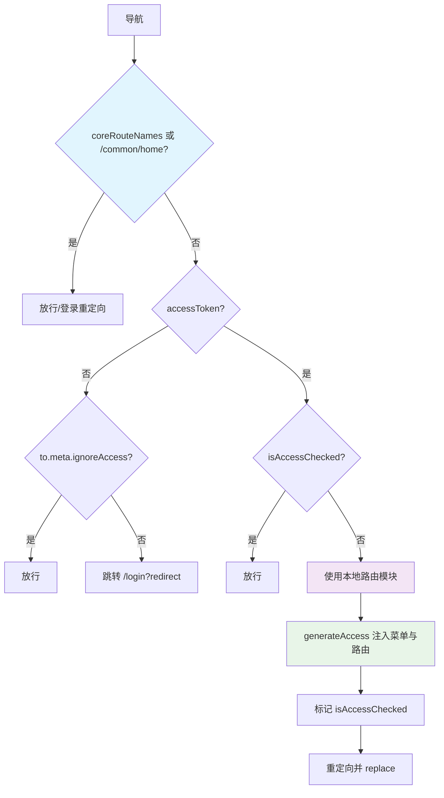

# MPurse Merchant · AI 开发导读文档

> 版本：v1.0.0  
> 日期：2025-10-10 18:30 (+08:00)

本导读面向 AI 开发者，帮助快速理解并安全介入 `apps/mpurse-merchant/` 的开发、调试与路由鉴权逻辑。遵循本项目工作流与注释规范，确保修改聚焦问题本身、最小化影响。

---

## 一、项目概览

- **[仓库类型]** Monorepo（pnpm workspaces + turbo）
- **[主应用]** `apps/mpurse-merchant/`（Vue 3 + TypeScript + Vite + Ant Design Vue + Pinia）
- **[运行要求]** Node >= 20.10（当前环境：v20.19.1）、pnpm 10.14.0
- **[启动端口]** `vite.server.port = 5588`（见 `apps/mpurse-merchant/vite.config.mts`）

## 二、本地运行与构建

- **安装依赖（根目录）**  
  `pnpm install`

- **开发启动（根目录）**  
  `pnpm dev`（通过 `turbo-run` 拉起 `mpurse-merchant`）  
  访问 `http://localhost:5588/`

- **独立启动（仅商户端）**  
  `pnpm -F mpurse-merchant run dev`

- **构建（多环境）**  
  - `pnpm run build:qa --filter=mpurse-merchant`
  - `pnpm run build:uat --filter=mpurse-merchant`
  - `pnpm run build:prod --filter=mpurse-merchant`

## 三、环境变量与配置

- **文件**：`apps/mpurse-merchant/.env.development`
  - 当前内容示例：
    - `NODE_ENV=testing`
    - `VITE_DEV=false`
    - `VITE_BASE_PATH=/`
    - `VITE_GLOB_API_URL='https://qaapi.mpurse.co.in/'`

- **建议（本地开发）**：
  - `NODE_ENV=development`
  - `VITE_DEV=true`
  - 按需调整 `VITE_GLOB_API_URL` 指向本地/测试网关

- **注意**：`.gitignore` 目前未忽略 `.env*`，如涉及敏感值请重新忽略或迁移至部署环境变量。

## 四、路由与鉴权核心逻辑

### 4.1 系统架构概述

- **入口**：`apps/mpurse-merchant/src/router/index.ts`  
  按 `import.meta.env.VITE_ROUTER_HISTORY` 与 `VITE_BASE` 选择 Hash/History；初始路由为"基础路由 + 404"（`routes` 来自 `src/router/routes/index.ts`）；安装守卫：`createRouterGuard(router)`（见 `src/router/guard.ts`）。

- **基础路由**：`src/router/routes/core.ts`  
  `Root` `'/'` 使用 `BasicLayout`，重定向到 `/common/home`；`Login` `'/login'`；兜底 `/:path(.*)*` → NotFound。

- **动态路由聚合**：`src/router/routes/index.ts`  
  通过 `import.meta.glob('./modules/**/*.ts', { eager: true })` + `mergeRouteModules()` 汇总。  
  导出：
  - `routes`（基础 + 404，仅初始化静态）
  - `accessRoutes`（参与鉴权过滤与动态挂载）
  - `coreRouteNames`（基础免鉴权白名单）

- **模块路由（示例）**：`src/router/routes/modules/`
  - `common.ts`：`/common/home`、`/common/settings`、`/product/payment-products` 等
  - `reports.ts`：所有路由使用绝对路径 `/common/payin`、`/common/payout`、`/common/pay-flow` 等
  - `transactionManage.ts`：父 `/transaction` 下 `pay-in-order`、`pay-out-order`、`refund-management`
  - 每个路由 `meta.code`（如 `merchant-home`）需与后端权限字段一致

### 4.2 修改后的路由鉴权流程（2025-10-11 更新）

**核心变更**：系统现在**始终使用本地路由模块**，不再依赖后端菜单数据，确保开发和生产环境的一致性。

#### 4.2.1 菜单数据来源
```typescript
// apps/mpurse-merchant/src/components/basic/menu/use-mixed-menu.ts
const menus = computed(() => {
  // 始终使用我们定义的路由模块，不依赖后端菜单数据
  console.log('Using local route modules for menu (all environments)');
  return accessRoutes as MenuRecordRaw[];
});

// apps/mpurse-merchant/src/router/access.ts
fetchMenuListAsync: async () => {
  // 始终使用我们定义的路由模块，不依赖后端菜单数据
  console.log('Using local route modules instead of backend menus (all environments)');
  return accessRoutes as any[];
}
```

#### 4.2.2 路由守卫逻辑
```typescript
// apps/mpurse-merchant/src/router/guard.ts
function setupAccessGuard(router: Router) {
  router.beforeEach(async (to, from) => {
    // 基本路由，这些路由不需要进入权限拦截
    if (coreRouteNames.includes(to.name as string) || to.path === '/common/home') {
      // 允许访问，不需要权限验证
      return true;
    }
    // ... 其他权限检查逻辑
  });
}
```

#### 4.2.3 Home路由特殊处理
```typescript
// apps/mpurse-merchant/src/router/routes/index.ts
const accessRoutes = [
  // 添加Home路由到菜单中
  {
    component: () => import('@/views/common/home.vue'),
    meta: {
      icon: 'lucide:house',
      order: 0, // 设置为最高优先级，显示在菜单顶部
      title: 'Home',
      menuVisibleWithForbidden: true,
    },
    name: 'Home',
    path: '/common/home',
  },
  ...dynamicRoutes,
  ...staticRoutes,
];

// 添加Home路由到核心路由名称列表中，确保它不需要权限验证
coreRouteNames.push('Home');
```

### 4.3 修改后的守卫时序流程



### 4.4 关键修改点说明

#### 4.4.1 菜单数据来源变更
- **修改前**：DEV环境使用测试菜单 + 后端菜单，生产环境使用后端菜单
- **修改后**：所有环境都使用本地路由模块（`accessRoutes`）
- **影响**：确保开发和生产环境的一致性，菜单不再依赖后端API

#### 4.4.2 路由守卫优化
- **新增**：`/common/home` 路径的特殊处理，绕过权限验证
- **原因**：确保Home页面可以正常访问，即使没有登录
- **实现**：在 `guard.ts` 中添加 `|| to.path === '/common/home'` 条件

#### 4.4.3 Home路由配置
- **添加到菜单**：将Home路由添加到 `accessRoutes` 中，确保显示在左侧菜单
- **添加到白名单**：将Home路由名称添加到 `coreRouteNames` 中，确保不需要权限验证
- **优先级设置**：设置 `order: 0`，确保Home菜单项显示在第一位

#### 4.4.4 路由路径规范化
- **问题**：reports.ts中的路由使用相对路径，导致404
- **解决**：所有路由改为绝对路径，使用 `/common/` 前缀
- **示例**：`payin` → `/common/payin`，`payout` → `/common/payout`

### 4.5 路由配置最佳实践

#### 4.5.1 路由定义规范
```typescript
// ✅ 推荐：使用绝对路径
{
  component: () => import('@/views/reports/payin-report.vue'),
  meta: {
    icon: 'lucide:file-chart-column',
    title: 'Payin Report',
    order: 1,
    code: 'merchant-payin-report',
    menuVisibleWithForbidden: true, // 确保显示在菜单中
  },
  name: 'Payin Report',
  path: '/common/payin', // 绝对路径
}

// ❌ 避免：使用相对路径
{
  path: 'payin', // 相对路径，可能导致404
}
```

#### 4.5.2 权限配置规范
```typescript
// 需要权限验证的路由
meta: {
  code: 'merchant-specific-code', // 必须与后端权限字段一致
  menuVisibleWithForbidden: true,  // 显示在菜单中
}

// 不需要权限验证的路由（添加到coreRouteNames）
// 在 routes/index.ts 中添加：
coreRouteNames.push('RouteName');
```

## 五、开发与改动注意事项

- **[最小化影响]** 修改聚焦需求，避免重构未经验证的逻辑；优先在对应模块内扩展。
- **[权限对齐]** 路由的 `meta.code` 必须与后端菜单或权限配置字段一致，否则会被过滤。
- **[JSDoc 注释]** 新增/修改逻辑，请达到 100% JSDoc 覆盖，描述“为什么/如何”，避免陈述显而易见。
- **[组件懒加载]** 大组件（尤其图表页）建议 `defineAsyncComponent` 增加 `loadingComponent` 与 `delay`，参考 `docs/MPurse Admin 项目优化指导文档.md`。
- **[日志控制]** DEV 可用 `console`；非 DEV 使用统一 Logger 或关闭调试输出。
- **[BASE/History]** 确保 `.env` 中 `VITE_BASE_PATH` 与部署路径一致；History 模式需服务器 SPA 回退。

## 六、常见问题与排错

### 6.1 路由访问问题

- **无法进入页面**：
  - 检查路由是否在 `coreRouteNames` 中（免鉴权）
  - 检查路由路径是否为绝对路径（避免相对路径导致的404）
  - 检查 `meta.menuVisibleWithForbidden` 是否为 `true`

- **Home页面无法访问**：
  - 确认 `/common/home` 路径在路由守卫中有特殊处理
  - 确认Home路由已添加到 `accessRoutes` 和 `coreRouteNames` 中
  - 检查路由重定向配置：`Root` 路由重定向到 `/common/home`

- **菜单不显示**：
  - 确认路由已添加到 `accessRoutes` 中
  - 检查 `meta.menuVisibleWithForbidden: true`
  - 确认菜单数据来源使用本地路由模块（不是后端数据）

### 6.2 权限验证问题

- **路由被拦截**：
  - 检查路由名称是否在 `coreRouteNames` 中
  - 检查 `to.meta.ignoreAccess` 是否为 `true`
  - 对于 `/common/home`，确认路由守卫中有特殊处理

- **菜单权限过滤**：
  - 系统现在使用本地路由模块，不再依赖后端菜单数据
  - 如需权限控制，在 `meta.code` 中配置权限字段

### 6.3 技术问题

- **412 或 API 异常**：检查 `VITE_GLOB_API_URL` 与后端加密开关一致性（参见根 `CHANGELOG.md` 相关记录）。  
- **History 刷新 404**：确认部署侧（Nginx/静态服务器）有 SPA 路由回退，或改为 Hash 模式（`VITE_ROUTER_HISTORY=hash`）。
- **路由404错误**：
  - 检查路由路径是否为绝对路径
  - 确认路由组件文件存在
  - 检查路由是否正确注册到Vue Router中

### 6.4 调试技巧

- **查看控制台日志**：
  - `Using local route modules for menu (all environments)` - 确认使用本地路由模块
  - `Using local route modules instead of backend menus (all environments)` - 确认菜单数据来源

- **检查路由配置**：
  - 在浏览器开发者工具中查看 `router.getRoutes()` 确认路由已注册
  - 检查 `accessStore.accessMenus` 确认菜单数据正确

- **权限调试**：
  - 在路由守卫中添加 `console.log` 查看权限检查流程
  - 检查 `coreRouteNames` 数组是否包含目标路由名称

## 七、关键文件速览

### 7.1 路由入口与守卫
- `apps/mpurse-merchant/src/router/index.ts` - 路由入口配置
- `apps/mpurse-merchant/src/router/guard.ts` - 路由守卫逻辑（**已修改**）
- `apps/mpurse-merchant/src/router/access.ts` - 权限与菜单生成（**已修改**）

### 7.2 路由定义
- `apps/mpurse-merchant/src/router/routes/core.ts` - 基础路由定义
- `apps/mpurse-merchant/src/router/routes/index.ts` - 路由聚合与导出（**已修改**）
- `apps/mpurse-merchant/src/router/routes/modules/*.ts` - 模块路由定义

### 7.3 菜单相关
- `apps/mpurse-merchant/src/components/basic/menu/use-mixed-menu.ts` - 菜单逻辑（**已修改**）
- `apps/mpurse-merchant/src/constants/fakemenus.ts` - 测试菜单配置

### 7.4 运行配置与脚本
- `apps/mpurse-merchant/vite.config.mts` - Vite配置
- `apps/mpurse-merchant/.env.development` - 环境变量
- 根脚本与工具：`package.json`、`scripts/turbo-run/*`

### 7.5 本次修改涉及的文件清单
```
✅ apps/mpurse-merchant/src/router/routes/index.ts
   - 添加Home路由到accessRoutes
   - 添加Home到coreRouteNames

✅ apps/mpurse-merchant/src/router/guard.ts  
   - 添加/common/home路径特殊处理

✅ apps/mpurse-merchant/src/router/access.ts
   - 修改为始终使用本地路由模块

✅ apps/mpurse-merchant/src/components/basic/menu/use-mixed-menu.ts
   - 修改菜单数据来源为本地路由模块

✅ apps/mpurse-merchant/src/router/routes/modules/reports.ts
   - 修复所有路由路径为绝对路径
```

---

如需补充“菜单字段与后端权限映射表”或“典型页面导航链路示例”，请告知模块范围与优先级。
