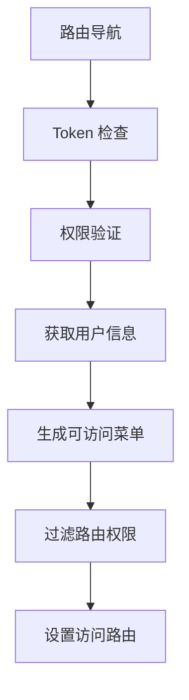

# MPURSE-CENTRAL 项目技术架构文档

## 🎯 项目概览

**MPurse Central** 是一个基于 Vue 3 + TypeScript 的现代化企业级后台管理系统，专门为 MPurse 金融平台提供中央管理功能。该项目采用 Vben 企业级框架，具有完整的商户管理、用户管理、报表统计、系统设置等核心业务功能。

### 核心特性
- 🚀 基于 Vue 3.5 + TypeScript 5.7 的现代化技术栈
- 📱 响应式设计，支持桌面和移动端
- 🔐 完整的权限控制和 SSO 单点登录
- 🎨 基于 Ant Design Vue + Tailwind CSS 的 UI 设计系统
- 📊 丰富的数据可视化和报表功能
- 🔧 基于 Vite 的快速构建和热更新

---

## 🏗️ 项目架构

### 技术栈概览

| 层次 | 技术选型 | 版本 | 用途 |
|------|----------|------|------|
| **前端框架** | Vue.js | 3.5.13 | 响应式用户界面框架 |
| **开发语言** | TypeScript | 5.7.3 | 类型安全的 JavaScript |
| **构建工具** | Vite | Latest | 快速构建和热更新 |
| **UI 组件库** | Ant Design Vue | Latest | 企业级 UI 组件 |
| **CSS 框架** | Tailwind CSS | 3.4.17 | 原子化 CSS 框架 |
| **状态管理** | Pinia | 2.1.7 | 现代化状态管理 |
| **路由管理** | Vue Router | Latest | 单页应用路由 |
| **HTTP 客户端** | Axios | Latest | HTTP 请求库 |
| **表单验证** | VeeValidate + Zod | Latest | 表单验证和模式验证 |
| **数据表格** | VXE Table | Latest | 高性能数据表格 |
| **图表库** | ECharts | Latest | 数据可视化 |
| **代码编辑器** | Monaco Editor | 0.52.2 | 代码编辑功能 |
| **包管理器** | pnpm | 9.12.0+ | 高效的包管理器 |

### 企业级框架集成 (Vben)

| Vben 模块 | 功能描述 |
|-----------|----------|
| `@vben/layouts` | 布局系统和页面结构 |
| `@vben/common-ui` | 通用 UI 组件库 |
| `@vben/stores` | 框架级状态管理 |
| `@vben/hooks` | 可复用的组合函数 |
| `@vben/utils` | 工具函数库 |
| `@vben/request` | HTTP 请求封装 |
| `@vben/access` | 权限控制系统 |
| `@vben/preferences` | 用户偏好设置 |

### 共享模块依赖

| 共享模块 | 功能描述 |
|----------|----------|
| `@shared/components` | 业务组件库 |
| `@shared/utils` | 共享工具函数 |
| `@shared/constants` | 共享常量定义 |
| `@shared/request` | API 请求封装 |
| `@shared/adapter` | 适配器层 |
| `@shared/pages` | 共享页面组件 |

---

## 📁 项目结构

```
apps/mpurse-central/
├── src/
│   ├── components/          # 应用级组件
│   ├── views/               # 页面组件
│   ├── router/              # 路由配置
│   ├── store/               # 状态管理
│   ├── request/             # API 接口定义
│   ├── utils/               # 工具函数
│   ├── constants/           # 常量定义
│   ├── styles/              # 样式文件
│   ├── locales/             # 国际化
│   └── layouts/             # 布局组件
├── public/                  # 静态资源
├── types/                   # TypeScript 类型定义
└── 配置文件
```

### 核心目录详解

#### 📄 页面组件 (src/views)
```
views/
├── home/                    # 首页和快速操作
├── merchant/                # 商户管理模块 (16 个页面)
├── mpurse/                  # MPurse 用户管理 (9 个页面)
├── reports/                 # 报表中心 (13 个报表)
├── settings/                # 系统设置 (15 个配置页面)
├── products/                # 产品管理
└── _core/                   # 核心页面 (登录、404 等)
```

#### 🧩 组件库 (src/components)
```
components/
├── Crud/                    # CRUD 通用组件
├── ComplexCrud/             # 复杂 CRUD 组件
├── FilePreview/             # 文件预览组件
├── IDCardUpload/            # 身份证上传组件
├── MerchantKycForm.vue      # 商户 KYC 表单
├── VpaInputList.vue         # VPA 输入列表
├── message/                 # 消息组件
└── notification/            # 通知组件
```

#### 🛣️ 路由系统 (src/router)
```
router/
├── routes/
│   ├── modules/             # 路由模块
│   │   ├── home.ts          # 首页路由
│   │   ├── merchant.ts      # 商户管理路由
│   │   ├── mpurse.ts        # MPurse 路由
│   │   ├── reports.ts       # 报表路由
│   │   └── settings.ts      # 设置路由
│   └── core.ts              # 核心路由
├── guard.ts                 # 路由守卫
├── access.ts                # 权限控制
└── index.ts                 # 路由配置
```

---

## 🌐 API 接口架构

### API 结构概览

```
src/request/api/
├── auth.ts                  # 认证相关 API
├── system.ts               # 系统核心 API
├── type.ts                 # API 类型定义
├── system-config/          # 系统配置 API
│   ├── admin.ts           # 管理员管理
│   ├── config.ts          # 配置管理
│   └── menu.ts            # 菜单管理
└── users-manager/         # 用户管理 API
    └── list.ts
```

### 核心 API 模块

#### 🔐 认证模块 (auth.ts)
| 接口路径 | HTTP方法 | 功能说明 |
|---------|----------|----------|
| `/mpmapi/login` | POST | 用户登录 |
| `/mpmapi/logout` | GET | 用户登出 |
| `/mpmapi/sso-login` | POST | SSO 单点登录 |
| `/mpmapi/refreshtoken` | POST | 刷新访问令牌 |
| `/mpmapi/userinfo` | GET | 获取用户信息 |
| `/mpmapi/sendotp` | POST | 发送 OTP 验证码 |

#### ⚙️ 系统管理模块 (system.ts)
| 接口分类 | 主要功能 |
|----------|----------|
| **MenuApi** | 菜单 CRUD 操作、内容类型管理 |
| **GroupApi** | 用户组管理、权限分配 |
| **UserApi** | 用户管理、状态控制 |
| **ConfigsAPI** | 系统配置管理 |
| **TaskAPI** | 定时任务管理 |
| **MerchantKYCAPI** | 商户 KYC 管理 |

### API 调用模式

#### 静态定义接口
- 在 `src/request/api` 目录下明确定义
- 约 40+ 个核心接口
- 完整的 TypeScript 类型定义

#### 动态调用接口
- 组件中直接使用 request 调用
- 配置化动态生成
- 估计 200+ 个业务接口

#### 缓存选择接口
- 专门用于下拉选择组件
- 自动缓存机制 (`useApiDataCache`)
- 支持搜索和过滤

---

## 🗺️ 路由与权限

### 路由架构特性
- **权限控制**: 基于权限代码的细粒度访问控制
- **动态路由**: 根据用户权限动态生成路由和菜单
- **SSO 集成**: 支持 Cloudflare SSO 单点登录
- **布局系统**: 支持多种布局模式切换

### 功能模块路由

| 模块 | 路由前缀 | 权限代码 | 页面数量 | 主要功能 |
|------|----------|----------|----------|----------|
| **Home** | `/home` | `console-home` | 2 | 概览、快速操作 |
| **Merchant** | `/merchant` | `console-merchant` | 14 | 商户管理、交易配置、产品管理 |
| **MPurse** | `/mpurse` | `console-mpurse` | 11 | 用户管理、资产管理、投诉处理 |
| **Reports** | `/report-center` | `console-report` | 9 | 各类业务报表 |
| **Settings** | `/settings` | `settings` | 15+ | 系统设置、用户管理、消息配置 |
| **API Center** | `/api-center` | `console-docs` | 1 | API 文档中心 |
| **Logs** | `/logs` | `console-logs` | 4 | 系统日志管理 |

### 权限控制流程


---

## 🏪 状态管理

### Pinia 状态架构

#### 应用级状态模块

**认证状态 (useAuthStore)**
```typescript
interface AuthState {
  memberInfo: any;           // 成员信息
  loginLoading: boolean;     // 登录加载状态
  isFirstVisit: boolean;     // 首次访问标识
}
```

**基础选项状态 (useBasicOptionsStore)**
```typescript
interface BasicOptionsState {
  brandOptions: BasicOptions[];          // 品牌选项
  categoryOptions: tCategoryOptions[];   // 分类选项
  ready: boolean;                        // 初始化状态
  customOptionsMap: Map<string, BasicOptions[]>;  // 自定义选项
  loadingFlags: Map<string, boolean>;    // 加载状态标记
}
```

#### Vben 框架级状态

**访问控制状态 (useAccessStore)**
```typescript
interface AccessState {
  accessCodes: string[];          // 权限码
  accessMenus: MenuRecordRaw[];   // 可访问菜单
  accessRoutes: RouteRecordRaw[]; // 可访问路由
  accessToken: string | null;    // 访问令牌
  refreshToken: string | null;   // 刷新令牌
  isAccessChecked: boolean;      // 权限检查状态
  loginExpired: boolean;         // 登录过期状态
}
```

### 数据流方向

#### 用户认证数据流
```
用户登录 → authStore.authLogin() → AuthApi.login() → 
获取Token → accessStore.setAccessToken() → 
获取用户信息 → userStore.setUserInfo() → 
设置权限码 → accessStore.setAccessCodes()
```

#### 页面数据获取流程
```
组件挂载 → 调用 API → API 响应 → 更新本地状态 → 
视图响应式更新 → 缓存机制 (useApiDataCache)
```

---

## 🧩 组件系统

### 核心业务组件

#### CRUD 组件系统
```typescript
// 位置: src/components/Crud/
interface CrudConfig {
  api: string;              // API 接口地址
  columns: ColumnConfig[];  // 表格列配置
  searchForm: FormConfig;   // 搜索表单配置
  actionBar: ActionConfig;  // 操作栏配置
}
```

**核心 Composable 功能**:
- `useComplexCurd`: 复杂 CRUD 逻辑封装
- `refreshTable()`: 表格刷新
- `handleAdd()`: 添加操作
- `handleEdit()`: 编辑操作  
- `handleDelete()`: 删除操作

#### 复杂组件示例

**商户 KYC 表单 (MerchantKycForm.vue)**
- 多步骤表单验证
- 文件上传和预览
- 动态字段渲染
- 实时数据校验

**VPA 输入列表 (VpaInputList.vue)**
- 动态列表添加/删除
- 表单验证集成
- 自定义输入组件

### 共享组件使用统计

| 组件类别 | 数量 | 主要用途 |
|----------|------|----------|
| **表单组件** | 15+ | 各类业务表单 |
| **数据展示** | 10+ | 表格、卡片、统计 |
| **反馈组件** | 8+ | 消息、通知、加载 |
| **导航组件** | 6+ | 菜单、标签页、面包屑 |
| **上传组件** | 5+ | 文件、图片上传 |

---

## 🎨 样式系统

### CSS 架构
- **Tailwind CSS**: 原子化 CSS 框架，快速构建 UI
- **Ant Design Variables**: 主题定制和设计令牌
- **SCSS 模块**: 组件级样式隔离
- **CSS Custom Properties**: 动态主题切换

### 主题配置
```scss
// src/styles/variable.scss
:root {
  --primary-color: #1890ff;
  --success-color: #52c41a;
  --warning-color: #faad14;
  --error-color: #f5222d;
}
```

---

## ⚡ 性能优化

### 构建优化
- **Vite 构建**: 基于 ESBuild 的快速构建
- **代码分割**: 按路由和功能模块分割
- **Tree Shaking**: 自动移除未使用代码
- **资源压缩**: 自动压缩 JS/CSS/图片

### 运行时优化
- **组件懒加载**: 路由组件按需加载
- **Keep-Alive 缓存**: 页面状态保持
- **虚拟滚动**: 大数据量表格优化
- **图片懒加载**: 减少初始加载时间

### 缓存策略
- **HTTP 缓存**: API 响应缓存
- **本地存储**: 用户状态持久化
- **内存缓存**: 组件数据缓存
- **ServiceWorker**: 离线缓存支持

---

## 🔧 开发工具链

### 开发环境
- **Vite Dev Server**: 热更新开发服务器
- **TypeScript**: 类型检查和智能提示
- **ESLint**: 代码质量检查
- **Prettier**: 代码格式化
- **Husky + lint-staged**: Git 钩子和预提交检查

### 构建环境
```bash
# 开发环境
pnpm dev

# 构建环境
pnpm build:qa      # 测试环境
pnpm build:uat     # 用户验收测试
pnpm build:prod    # 生产环境

# 代码检查
pnpm lint          # ESLint 检查
pnpm format        # 代码格式化
pnpm typecheck     # TypeScript 类型检查
```

### 测试策略
- **Unit Testing**: Vitest + Happy DOM
- **E2E Testing**: Playwright
- **Component Testing**: Vue Test Utils
- **API Testing**: Mock Service Worker

---

## 🌍 国际化支持

### 多语言配置
```typescript
// src/locales/langs/
├── zh-CN/           # 中文简体
│   ├── common.json  # 通用词汇
│   ├── page.json    # 页面专用
│   └── demos.json   # 示例内容
└── en-US/           # 英文
    ├── common.json
    ├── page.json
    └── demos.json
```

### 使用方式
```vue
<template>
  <div>{{ $t('common.welcome') }}</div>
</template>
```

---

## 🔐 安全机制

### 认证授权
- **JWT Token**: 基于 JSON Web Token 的身份认证
- **Token 刷新**: 自动刷新过期 Token
- **SSO 集成**: Cloudflare 单点登录
- **OTP 验证**: 双因子身份验证

### 权限控制
- **RBAC**: 基于角色的访问控制
- **Fine-grained Permissions**: 细粒度权限控制
- **Route Guards**: 路由级权限验证
- **API 授权**: 接口级权限校验

### 数据安全
- **HTTPS**: 全站 HTTPS 加密传输
- **XSS 防护**: 输入输出过滤
- **CSRF 防护**: 跨站请求伪造防护
- **敏感信息脱敏**: 日志和界面敏感信息处理

---

## 📊 监控与日志

### 系统监控
- **性能监控**: 页面加载性能追踪
- **错误监控**: 前端错误自动收集
- **用户行为**: 用户操作路径分析
- **API 监控**: 接口调用成功率和耗时

### 日志系统
```typescript
// 日志类型
- 操作日志: 用户操作记录
- 错误日志: 系统异常记录  
- 登录日志: 用户登录追踪
- 系统日志: 系统运行状态
```

---

## 🚀 部署架构

### 环境配置
| 环境 | 域名 | 构建命令 | 用途 |
|------|------|----------|------|
| **Development** | localhost:5566 | `pnpm dev` | 本地开发 |
| **QA** | qa.mpurse.com | `pnpm build:qa` | 质量保证测试 |
| **UAT** | uat.mpurse.com | `pnpm build:uat` | 用户验收测试 |
| **Production** | admin.mpurse.com | `pnpm build:prod` | 生产环境 |

### 容器化部署
```dockerfile
FROM node:20-alpine
WORKDIR /app
COPY package*.json ./
RUN pnpm install
COPY . .
RUN pnpm build:prod
EXPOSE 80
CMD ["pnpm", "preview"]
```

---

## 📈 项目统计

### 代码规模
- **总文件数**: 500+ 个文件
- **代码行数**: 50,000+ 行代码
- **组件数量**: 90+ 个 Vue 组件
- **API 接口**: 200+ 个接口

### 功能模块统计
| 模块 | 页面数 | 组件数 | API 数 |
|------|--------|--------|--------|
| **商户管理** | 16 | 20+ | 80+ |
| **用户管理** | 11 | 15+ | 40+ |
| **报表中心** | 13 | 10+ | 30+ |
| **系统设置** | 15 | 12+ | 25+ |
| **其他模块** | 10+ | 30+ | 25+ |

### 依赖统计
- **生产依赖**: 80+ 个包
- **开发依赖**: 50+ 个包
- **共享依赖**: 15+ 个内部包

---

## 🔮 技术发展建议

### 短期优化 (1-3 个月)
1. **性能优化**: 进一步优化首屏加载时间
2. **用户体验**: 完善加载状态和错误处理
3. **代码质量**: 提升测试覆盖率至 80%
4. **文档完善**: 补充 API 文档和组件文档

### 中期规划 (3-6 个月)  
1. **微前端架构**: 考虑拆分大型模块为独立应用
2. **PWA 支持**: 添加 Progressive Web App 特性
3. **移动端适配**: 优化移动端用户体验
4. **可视化升级**: 引入更丰富的图表组件

### 长期展望 (6-12 个月)
1. **Vue 3.6+**: 跟进 Vue.js 最新特性
2. **Serverless**: 探索 Serverless 部署方案
3. **AI 集成**: 集成 AI 辅助功能
4. **国际化扩展**: 支持更多语言和地区

---

## 📚 学习资源

### 官方文档
- [Vue 3 官方文档](https://vuejs.org/)
- [Vite 构建工具](https://vitejs.dev/)
- [Pinia 状态管理](https://pinia.vuejs.org/)
- [Ant Design Vue](https://antdv.com/)
- [Tailwind CSS](https://tailwindcss.com/)

### 框架资源
- [Vben Admin 文档](https://doc.vvbin.cn/)
- [Vue Router 文档](https://router.vuejs.org/)
- [VeeValidate 表单验证](https://vee-validate.logaretm.com/)

### 开发工具
- [Vue DevTools](https://devtools.vuejs.org/)
- [Vite DevTools](https://github.com/antfu/vite-plugin-vue-devtools)
- [TypeScript](https://www.typescriptlang.org/)

---

## 🤝 开发规范

### 代码规范
1. **命名规范**: 使用 camelCase 和 PascalCase
2. **组件结构**: 遵循 Vue 3 Composition API 规范
3. **类型定义**: 所有函数必须有 TypeScript 类型
4. **注释规范**: 使用 JSDoc 格式，注释率 100%

### Git 工作流
```bash
# 功能开发
git checkout -b feature/new-feature
git commit -m "feat: 添加新功能"
git push origin feature/new-feature

# Bug 修复  
git checkout -b fix/bug-description
git commit -m "fix: 修复问题描述"
git push origin fix/bug-description
```

### 提交信息规范
```
feat: 新功能
fix: Bug 修复
docs: 文档更新
style: 代码格式调整
refactor: 代码重构
test: 测试相关
chore: 构建过程或辅助工具的变动
```

---

## 🔚 总结

MPurse Central 是一个技术先进、架构合理的现代化企业级管理系统。它具备以下核心优势：

### ✅ 技术优势
- **现代化技术栈**: Vue 3.5 + TypeScript + Vite 
- **企业级框架**: 基于成熟的 Vben 框架
- **完善的工程化**: ESLint、Prettier、Husky 等完整工具链
- **高性能**: Vite 构建 + 组件懒加载 + 智能缓存

### ✅ 架构优势  
- **模块化设计**: 清晰的功能模块划分
- **组件化开发**: 高度可复用的组件系统
- **状态管理**: Pinia + 持久化的完整方案
- **权限控制**: 基于角色的精细化权限系统

### ✅ 开发体验
- **TypeScript**: 完整的类型安全
- **热更新**: 快速的开发反馈
- **代码提示**: 智能的开发工具支持
- **调试工具**: 完善的调试和监控工具

这个项目为前端开发团队提供了一个稳定、高效、可维护的技术基础，能够支撑复杂的企业级业务需求，并为未来的功能迭代和技术升级提供了良好的架构基础。

---

**文档版本**: v1.0.0  
**更新时间**: 2025-08-27  
**维护团队**: MPurse 前端开发团队

> 📝 本文档将持续更新，如有疑问或建议，请联系开发团队。
